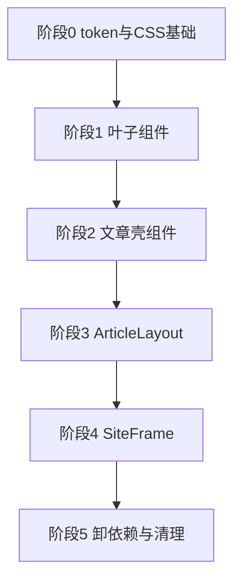

# Chakra Migration Conversation Transcript

> 以下内容为 Auto 根据 Cursor agent 会话 `811832d4-ca6e-4e43-9933-3c2236123a97` 整理，未经过人工逐条核对，请谨慎对待。

- Prompt transcript: `811832d4-ca6e-4e43-9933-3c2236123a97` (Cursor agent session)
- Scope: user-visible conversation messages only; excludes system/developer instructions and tool payload internals.
- Topic: evaluating and migrating umamichi.moe off Chakra UI (phases 0–4).

## 1. User

请问 umamichi.moe 继续使用 chakra 的必要性

## 2. Assistant

先梳理项目里 Chakra 的实际使用范围，以及是否已有替代 UI 方案。

## 3. Assistant

根据代码库现状，**继续依赖 Chakra 并非技术必需**；它目前主要扮演「React 里的布局/样式 DSL」，而不是站点视觉与交互的核心。

## 当前 Chakra 实际在做什么

Chakra 的使用范围很集中：只在 `src/components/chakra/` 下的约 13 个组件，以及 `src/components/ui/provider.tsx` 的 `ChakraProvider`。

主内容页链路是：

```124:143:src/layouts/BlogPost.astro
		<ArticleLayout
			copyright={copyright}
			currentPostId={currentEntryId}
			currentPath={currentPath}
			headings={headings}
			navItems={docsStructure.topLevelNavItems}
			nextPost={nextPost}
			previousPost={previousPost}
			sidebarTree={sidebarTree}
			title={title}
			tags={tags}
			pubDate={formattedPubDate}
			sourceMarkdown={sourceMarkdown}
			sourceUrl={sourceUrl}
			updatedDate={formattedUpdatedDate}
			heroImage={heroImage ? { src: heroImage.src } : undefined}
		>
			<slot />
			{comment && <ArticleComments slot="comments" client:idle />}
		</ArticleLayout>
```

`ArticleLayout` **没有** `client:*` 指令，因此在 Astro 构建期做 **静态 SSR**，输出 HTML，Chakra 的运行时代码通常**不会**进浏览器 bundle。

Chakra 在这里提供的主要是：

| 用途 | 示例 |
|------|------|
| 布局原语 | `Box`、`Stack`、`Flex`、`Container`、`HStack` |
| 响应式 props | `display={{ base: "none", md: "block" }}` |
| 排版组件 | `Heading`、`Text` |
| 少量交互壳 | `IconButton`、`Link`、`Icon` |
| 设计 token 引用 | `--chakra-font-sizes-md`、`--chakra-sizes-4xl` |

很多组件非常薄，例如 `ArticleContent` 本质上就是：

```4:6:src/components/chakra/ArticleContent.tsx
export function ArticleContent({ children }: PropsWithChildren) {
  return <Box className="article-content">{children}</Box>
}
```

## 真正驱动站点外观与交互的，不是 Chakra

**视觉体系**来自 `@umamichi-ui/common-css` 和自建 CSS 变量（`--site-bg`、`--theme-400`、`--article-title-bar` 等）。Chakra 组件里大量颜色、背景都直接写 CSS 变量，而不是 Chakra theme：

```118:118:src/components/chakra/SiteFrame.tsx
      <Box minH="100vh" bg="var(--site-bg)" color="var(--site-fg)">
```

**交互逻辑**（主题切换、移动菜单、复制 Markdown 等）在 `SiteChromeScripts.astro` 的 vanilla JS 里，通过 `data-site-*` 属性驱动，不依赖 Chakra 的 client 状态。

**错误页**（404/500 等）已经是纯 Astro + CSS，没有 Chakra，说明站点完全可以不依赖它运行。

## 与 Umamichi UI 约定的关系

你的 UI 约定强调：内容语义优先、不用卡片/阴影/渐变、以白灰 + aqua 主题色为主。  
Chakra 自带一套完整 design system（spacing、shadow、默认组件风格），但本仓库**基本没用那套**，而是：

1. 用 `defaultSystem`，几乎未定制 Chakra theme  
2. 用 CSS 变量覆盖视觉  
3. 在 `global.css` 里还要桥接 Chakra 的 focus ring token

结果是 **两套 token 并存**：Chakra 的 `--chakra-*` 和 Umamichi 的 `--theme-*` / `--site-*`。从设计一致性角度看，Chakra 是额外一层，而不是权威来源。

## 继续保留 Chakra 的理由（有限但真实）

1. **已经跑通**，迁移有成本，收益主要是架构清晰，不是功能缺口。  
2. **构建期 SSR**，对首屏 JS 体积影响小；主要成本在依赖维护与心智负担。  
3. **TSX 里写响应式布局**比纯 CSS class 或 Astro 模板略省事，尤其 `SiteFrame` 这种复杂导航壳。  
4. **React 本身仍可能需要**：`ArticleComments` 用 `@giscus/react`（`client:idle`），`SiteFrame` 用 `?react` SVG 导入——去掉 Chakra 不等于去掉 React。

## 去掉 Chakra 的可行方向

若目标是与 Umamichi UI 对齐、减依赖，路径大致是：

1. **把 `components/chakra/` 逐步迁到 Astro 组件 + CSS**（错误页已是先例）  
2. **或保留 React，但改用 plain JSX + CSS modules / common-css class**，不再引入 `@emotion/react`  
3. **仅保留 React island**：Giscus、必要时 SVG 组件  
4. **统一 token**：字号、行高、断点都走 `@umamichi-ui/common-css`，去掉 `--chakra-font-sizes-*` 这类引用

迁移量集中在 `SiteFrame.tsx`（约 530 行）和 `ArticlePostList` 等递归导航组件；文章区组件相对简单。

## 结论

| 维度 | 判断 |
|------|------|
| 功能必需性 | **低** — 交互、主题、导航都不靠 Chakra runtime |
| 视觉必需性 | **低** — 外观由 common-css + 自建变量决定 |
| 架构契合度 | **偏低** — 与 Umamichi UI 约定存在平行设计系统 |
| 保留的合理理由 | 已投入、SSR 无客户端惩罚、TSX 布局写法方便 |
| React 是否仍需要 | **是**（至少 Giscus；SVG 也可改写法后评估） |

**简短回答**：对 umamichi.moe 而言，继续用 Chakra **不是必要**的；它目前是历史选型下的「React 布局层」，而非站点不可替代的基础。若你更在意与 Umamichi UI 统一、减少 `@chakra-ui/react` + `@emotion/react` 维护成本，迁移是有明确收益的；若当前开发节奏优先、站点稳定，保留 Chakra 也**不会**因为 client bundle 而带来明显性能问题。

若你想进一步评估，我可以按「迁移成本 / 风险 / 推荐顺序」拆一版具体迁移计划（仍保持 Ask 模式，只给方案不写代码）。

## 4. User

请“按「迁移成本 / 风险 / 推荐顺序」拆一版具体迁移计划”

## 5. Assistant

先梳理各 Chakra 组件的依赖关系与耦合点，再据此给出可执行的迁移计划。

## 6. Assistant

以下是一份针对 **umamichi.moe 去掉 Chakra、对齐 Umamichi UI + Astro 架构** 的迁移计划。估算基于当前约 **1,300 行** Chakra 相关 TSX（其中 `SiteFrame.tsx` 约 530 行占大头），以及 **13 个文件 + 1 个 provider + 少量 CSS 桥接**。

---

## 目标架构（迁移终点）

| 保留 | 移除 |
|------|------|
| Astro 页面/布局、`@umamichi-ui/common-css`、`SiteChromeScripts.astro` 的 vanilla 交互 | `@chakra-ui/react`、`@emotion/react`、`ChakraProvider` |
| React island：仅 `ArticleComments`（Giscus）及你仍选择保留的递归/复杂 TSX | `--chakra-*` token 引用、Chakra 专属 props（`_hover`、`css={}` 对象式 responsive） |
| 现有 `data-site-*` / `data-toc-*` 等 DOM 契约 | `components/chakra/` 目录（迁完后改名或删除） |

**推荐技术选型**：以 **Astro 组件 + CSS（含 common-css token）** 为主；`ArticlePostList` 等递归树可二选一——**Astro 自递归** 或 **plain React（无 Chakra）**。鉴于 `BlogPost.astro` 已在服务端聚合数据，**优先 Astro** 更贴合站点现有模式（错误页已是先例）。

---

## 阶段 0：基础设施与 token 统一

**做什么**

1. 在 `global.css`（或新建 `src/styles/site-layout.css`）定义替代 Chakra token 的变量，例如：
   - `--site-main-max-w`（替代 `4xl` / `--chakra-sizes-4xl`）
   - `--site-content-font-size`、`--site-content-line-height`（替代 `--chakra-font-sizes-*`）
   - 断点常量与现有 `48rem`、`xl` 侧栏逻辑对齐
2. 抽一组 **utility / component class**，覆盖 Chakra 高频模式：
   - `.site-button`（已有 `data-site-button`，可补全 hover/active）
   - `.site-sidebar-panel`、`.site-sidebar-scroll`（隐藏滚动条那套）
   - responsive 用 `@media`，与 `global.css` 里 `--site-header-offset` 断点一致
3. **重构 `article-sidebar-link.ts`**：返回值从 Chakra props 改为 **CSS class 名 + 可选 `style={{ paddingInlineStart }}`**（当前 `ps={indent}` 本质是 `indent * 0.25rem` 量级，需对照 Chakra spacing scale 目测一次）

**迁移成本**：低（约 0.5～1 人日）  
**风险**：低  
**验收**：不改 UI 的前提下，可在 dev 里临时把 `SITE_MAIN_HALF_W` 换成新 CSS 变量，目视侧栏 fixed 定位是否与现站一致。

---

## 推荐迁移顺序（由易到难）

整体策略：**绞杀者模式**——逐文件替换，最后删 `ChakraProvider`；每步可独立 PR，避免大爆炸。



---

### 阶段 1：叶子组件（7 个，几乎无逻辑）

| 文件 | 行数 | Chakra 用法 | 迁移动作 | 成本 | 风险 |
|------|------|-------------|----------|------|------|
| `ArticleContent.tsx` | 6 | `Box` + className | 直接删，改为 Astro/HTML wrapper | 极低 | 极低 |
| `ArticleHeroImage.tsx` | 13 | `Box`/`Image` | `<figure></figure>` + CSS | 极低 | 低（`object-fit`/`max-height`） |
| `ArticleHeader.tsx` | 36 | `Stack`/`Heading`/`Text` | 语义 HTML + CSS 响应式字号 | 低 | 低 |
| `ArticleTags.tsx` | 43 | `Wrap`/`Link` | flex-wrap + `data-site-button` 链接 | 低 | 低 |
| `SiteNavTextOutlineFilter.tsx` | 29 | 无 Chakra | 改为 `.astro` 或内联 SVG 片段 | 极低 | 极低 |
| `ArticleSourceActions.tsx` | 118 | `chakra.button`/`textarea` | 原生 `<button>`/`<textarea>`，**保留全部 `data-*`** | 低 | **中**（见下） |
| `ArticleHeroImage` 等类型导出 | — | — | `ArticleTag` 类型移到 `src/lib/` 或 `.astro` 旁 | 低 | 低 |

**阶段 1 特别风险：`ArticleSourceActions`**

- `SiteChromeScripts.astro` 通过 `[data-article-source-tools]` 等选择器绑定行为；**DOM 契约不能变**。
- 去掉 Chakra 后要用普通 CSS 实现 `roundedLeft`/`roundedRight` 组合按钮外观。
- **验收**：桌面/移动各测一次「GitHub 源文件 / 展开菜单 / 复制 Markdown / toast」。

**阶段 1 合计**：约 1～1.5 人日  
**建议 PR 粒度**：1～2 个 PR（先纯展示组件，再 `ArticleSourceActions`）

---

### 阶段 2：中等复杂度文章组件（4 个）

| 文件 | 行数 | 要点 | 成本 | 风险 |
|------|------|------|------|------|
| `ArticleToc.tsx` | 86 | 与 `ArticleTocScript.astro` 联动；保留 `data-toc`、`data-toc-link` | 低 | **中** |
| `ArticlePostList.tsx` | 105 | 递归树；依赖 `getArticleSidebarLinkStyle` 改造 | 中 | **中** |
| `ArticlePrevNext.tsx` | 76 | responsive flex；`data-site-button` | 低 | 低 |
| `ArticleCopyright.tsx` | 65 | 边框区块；CC 徽章 img | 低 | 低 |

**风险细节**

- **TOC**：`ArticleTocScript` 依赖 heading slug 与 `aria-current="location"`；迁移时 CSS 选择器 `[aria-current="location"]` 需等价保留（当前在 Chakra `css` prop 里）。
- **PostList 递归**：若改 Astro，用 `{tree.children.map(...)}` 自调用子组件即可；若保留 React，去掉 Chakra 后仍可用，但 Astro 更一致。
- **`getArticleSidebarIndent`**：注释写「Chakra `ps` token」；迁移时改为 `padding-inline-start: calc(var(--space-unit) * N)` 或固定 rem。

**阶段 2 合计**：约 1.5～2 人日  
**验收清单**：
- 带 sidebar 的长文：左侧导航滚动、当前项高亮
- 带 h2/h3 的长文：右侧 TOC 滚动与高亮
- 有 CC 版权 / 自定义 statement 各一篇
- 有 prev/next 的文章页

---

### 阶段 3：`ArticleLayout` 组装层

**做什么**

- 将 `ArticleLayout.tsx` 拆为 **`ArticleLayout.astro`**（或 `SiteArticle.astro`）：
  - 侧栏 fixed 定位公式改用 `--site-main-max-w`（不再引用 `SITE_MAIN_HALF_W` 的 chakra calc）
  - slot 继续承载 MDX/Markdown 正文与 `ArticleComments`
  - `xl` 断点侧栏显示/隐藏与现站 pixel 对齐（Chakra `xl` ≈ 80em，需用 devtools 对比一次）

**成本**：中（约 1～1.5 人日）  
**风险**：**中高**——这是唯一集中 **三栏布局数学** 的地方：

```73:73:src/components/chakra/ArticleLayout.tsx
            left={`max(1rem, calc(50vw - ${SITE_MAIN_HALF_W} - ${ARTICLE_SIDEBAR_W} - ${ARTICLE_SIDEBAR_GAP}))`}
```

- 建议把 `ARTICLE_SIDEBAR_W`、`ARTICLE_SIDEBAR_GAP` 也提成 CSS 变量，避免 magic string。
- 测 **1280px 附近**（侧栏出现/消失临界）和 **窄屏 mobile post list**。

**验收**：随机 3 篇不同结构文章 + 1 个纯目录 listing 页（`GeneratedDocListPage`）。

---

### 阶段 4：`SiteFrame`（导航壳，最大块）

**做什么**

- `SiteFrame.tsx` → **`SiteFrame.astro`** + 少量 CSS
- Metro 导航 SVG：可继续 `?react`（则仍要 React 运行时用于 SSR 这一段），或 **内联 SVG / `` / Astro 组件**（推荐后者，进一步缩小 React 面）
- 保留：
  - `data-astro-transition-persist="header|footer"`
  - `data-site-header`、`data-site-mobile-menu`、`data-nav-*`
  - `className="wpm-pane-shift"` 等 windows-phone-motion 钩子
- 页脚去掉 Chakra 链接文案，改为 Astro / common-css 等

**成本**：高（约 2～3 人日）  
**风险**：**高**——影响全站：

| 风险点 | 缓解 |
|--------|------|
| 响应式导航 desktop/mobile 切换 | 对照 767px / 768px 各测一轮 |
| sticky header + `--site-header-offset` | 与 `global.css` 联动回归 |
| 主题切换按钮 DOM 结构 | 保留 `[data-site-theme-toggle]` 与子 icon span |
| View Transitions / persist | 改 DOM 层级前先录屏现站，改后逐页对比 |
| 运行线动画 `navbar-running-line` | 不改 class/data 即可 |

**建议**：单独一个 PR，合并前做 **全站 smoke**（首页、任意 blog、tag 页、out-of-site 若走不同 layout 则除外）。

---

### 阶段 5：卸依赖与清理

**做什么**

1. 删除 `src/components/ui/provider.tsx`
2. 从 `package.json` 移除 `@chakra-ui/react`、`@emotion/react`
3. 清理 `global.css` 中 `--chakra-colors-*` 桥接
4. 删除 `src/components/chakra/`，更新 `BlogPost.astro` import
5. 更新 `README.md` 徽章与「UI 组件」描述
6. `npm run build` + 目视 diff 关键页

**成本**：低（约 0.5 人日）  
**风险**：低（若前阶段验收充分）

**React 是否可一并移除？**  
- **不能**：`ArticleComments` + `@giscus/react` 仍需要。  
- `@astrojs/react` 保留；client bundle 仅 comments island。

---

## 风险总表

| 等级 | 项 | 影响 | 对策 |
|------|----|------|------|
| 高 | `SiteFrame` 响应式 + transition persist | 全站导航/切页异常 | 单独阶段、全站 smoke、保留 data 契约 |
| 中高 | 侧栏 fixed 定位 calc | 宽屏布局错位 | 阶段 0 先固定 CSS 变量，视觉回归 |
| 中 | TOC / 源文件菜单 DOM 契约 | 交互失效 | 不改 `data-*`；脚本侧加注释锁定契约 |
| 中 | `getArticleSidebarLinkStyle` 类型与样式 | 侧栏字重/颜色不一致 | 阶段 0 改为 class-based API |
| 低 | 焦点环样式 | a11y 退化 | 沿用 `:focus-visible` + `--site-focus-visible-outline-color` |
| 低 | 构建体积 | 预期略降（主要减 dev/build 复杂度） | 对比 build 前后 `dist/_astro` 体积 |

---

## 时间与 PR 建议

| 方案 | 人日 | 说明 |
|------|------|------|
| 紧凑连续做 | 5～7 | 一人全职约一周 |
| 增量（推荐） | 2～3 周 | 每阶段 1～2 PR，不影响日常发文 |

**推荐 PR 顺序**（6 个）：

1. `chore: site layout tokens without chakra`
2. `refactor: migrate leaf article components off chakra`
3. `refactor: migrate toc/postlist/prevnext/copyright off chakra`
4. `refactor: replace ArticleLayout with astro`
5. `refactor: replace SiteFrame with astro`
6. `chore: remove chakra and emotion`

---

## 每阶段最小测试矩阵

| 页面类型 | 必测项 |
|----------|--------|
| 普通文章 | 标题栏、正文样式、标签、TOC、评论 lazy load |
| 带 hero 文章 | 图片裁切 `max-height` |
| 带 sidebar 目录 | 左栏滚动、current 高亮、mobile 折叠块 |
| 带 GitHub 源 | 复制 Markdown、菜单开合 |
| 带 CC 版权 | 徽章与链接 |
| 有 prev/next | 窄/宽屏排列 |
| 目录 listing | `FolderDocListView` 不受影响 |
| 全站 chrome | 主题切换、移动菜单、X/GitHub 链接、页脚 |
| 错误页 | 确认仍无回归（本来就不走 Chakra） |

---

## 不建议做的事（控制范围）

- 不要借迁移重做 **Umamichi UI 视觉改版**（先 1:1 parity，再单独开设计迭代）
- 不要把 **Giscus** 改成 Astro（无收益）
- 不要一次性把 **`SiteChromeScripts.astro`** 改框架（1000+ 行 inline JS，与 Chakra 无关）
- 不要引入 **Tailwind** 等新体系，除非你想第二次大迁移；直接扩 common-css + 站点 CSS 更一致

---

## 决策点（开工前定一条）

**`ArticlePostList` / `ArticleToc` 用 Astro 还是 plain React？**

| 选项 | 优点 | 缺点 |
|------|------|------|
| **Astro（推荐）** | 与错误页、listing 一致；构建期零 client JS | 递归组件写法需熟悉 Astro |
| **Plain React** | 改动最小，复制粘贴去 Chakra 即可 | 保留 React SSR 路径，架构略分裂 |

若你倾向 **长期只留 Giscus 一个 island**，选 Astro。

---

如果你之后切换到 Agent 模式，可以从 **阶段 0 + `ArticleContent`/`ArticleHeroImage`** 开始做第一个 PR，风险最低、能立刻验证 token 方案是否够用。需要的话我也可以把某一阶段再细化成「文件级 checklist（含建议 class 名）」。

## 7. User

请进行阶段0

## 8. Assistant

开始阶段 0：先读取现有样式与 Chakra token 用法，再统一 layout token 并重构 `article-sidebar-link.ts`。

## 9. Assistant

正在创建 `site-layout.css`、重构 `article-sidebar-link.ts`，并更新相关引用以接入新 token。

## 10. Assistant

阶段 0 已完成，`npm run build` 通过。变更摘要如下：

## 新增文件

**`src/styles/site-layout.css`** — 布局 token 与共用样式：
- 布局：`--site-main-max-w`（56rem）、`--site-main-half-w`、`--site-frame-max-w`（72rem）
- 侧栏：`--site-article-sidebar-w`、`--site-article-sidebar-gap`
- 正文：`--site-content-font-size` / `--site-content-line-height`（48rem 断点与原先 Chakra md/lg 对齐）
- 间距：`--site-space-unit`（0.25rem，对应 Chakra spacing）
- 工具类：`.site-button`、`.site-sidebar-panel`、`.site-sidebar-scroll`、`.site-sidebar-links`、`.site-sidebar-link--*`

**`src/lib/site-layout.ts`** — TS 侧布局常量：
- `SITE_MAIN_MAX_W`、`ARTICLE_SIDEBAR_FIXED_INSET`（侧栏 fixed 定位公式）

## 重构

**`src/lib/article-sidebar-link.ts`**
- 移除 Chakra 风格 props（`getArticleSidebarLinkStyle`、`_hover` 等）
- 新增 `getArticleSidebarLinkClassName()`、`getArticleSidebarIndentStyle()`、`getArticleSidebarIndentUnits()`

**已接入新 API 的组件**
- `ArticlePostList.tsx`、`ArticleToc.tsx` — 使用 CSS class + indent style，并挂上 sidebar 工具类
- `ArticleLayout.tsx` — 侧栏定位改用 CSS 变量
- `SiteFrame.tsx` — 去掉 `--chakra-font-sizes-*` / `--chakra-sizes-*`，主内容区用 `.site-route-main`
- `article-toc.ts` — 跟随 indent API 更名

**`BaseHead.astro`** — 引入 `site-layout.css`

## 刻意保留

`global.css` 里的 `--chakra-colors-*` focus ring 桥接仍在，Chakra 卸载前（阶段 5）还需要。

---

建议在 dev 里目视确认：带侧栏的长文、TOC 高亮、窄/宽屏切换。若侧栏链接颜色被 Chakra `Link` 默认样式压住，阶段 1 迁移到原生 `<a>` 时会一并解决。

需要的话可以继续做阶段 1（叶子组件迁移）。

## 11. User

请提交

## 12. Assistant

已提交。

**提交**：`fad4d9a`  
**标题**：`refactor: add site layout tokens for Chakra migration phase 0 by vibe coding`

**变更概览**（9 个文件，+207 / −118）：
- 新增 `src/styles/site-layout.css`、`src/lib/site-layout.ts`
- 侧栏链接样式改为 CSS class API（`article-sidebar-link.ts`）
- `ArticlePostList`、`ArticleToc`、`SiteFrame`、`ArticleLayout` 接入新 token
- `BaseHead.astro` 引入 `site-layout.css`

当前分支比 `origin/main` 超前 1 个提交，工作区干净。需要 push 时说一声即可。

## 13. User

请进行阶段1

## 14. Assistant

开始阶段 1：先读取待迁移的叶子组件及其在布局中的引用关系。

## 15. Assistant

正在创建无 Chakra 的 `article/` 组件、补充样式，并更新引用。

## 16. Assistant

阶段 1 已完成，`npm run build` 通过。

## 迁移内容

**新建 `src/components/article/`（无 Chakra 的 plain React）**
- `ArticleHeader.tsx` — 语义化 `<header>` + CSS
- `ArticleTags.tsx` — `<ul>` + `.article-tag.site-button`
- `ArticleHeroImage.tsx` — `<figure>` / ``
- `ArticleSourceActions.tsx` — 原生 `<button>` / `<textarea>`，保留全部 `data-*` 契约

**新建**
- `src/lib/article.ts` — `ArticleTag` 类型
- `src/components/SiteNavTextOutlineFilter.astro` — 从 React 迁出，由 `BlogPost.astro` 注入

**删除的 Chakra 叶子组件**
- `ArticleContent`、`ArticleHeader`、`ArticleTags`、`ArticleHeroImage`、`ArticleSourceActions`、`SiteNavTextOutlineFilter`（均在 `chakra/` 下）

**其它更新**
- `ArticleLayout.tsx` — 改从新路径导入；正文改为 `<div className="article-content">`
- `SiteFrame.tsx` — 移除 SVG 滤镜组件
- `BlogPost.astro` — 引入 `SiteNavTextOutlineFilter`；`ArticleTag` 改从 `lib/article` 导入
- `site-layout.css` — 补充 article header、hero、tags、source actions 样式

## 建议本地目视确认

- 带 hero 的文章页
- 带标签的文章页
- 有 GitHub 源文件按钮的页面：展开菜单、复制 Markdown
- 导航当前项文字描边（`SiteNavTextOutlineFilter` 仍生效）

需要提交或继续阶段 2 时说一声。

## 17. User

请提交

## 18. Assistant

已提交。

**提交**：`edfbdf7`  
**标题**：`refactor: migrate leaf article components off Chakra (phase 1) by vibe coding`

**变更概览**（16 个文件，+320 / −259）：
- 新增 `src/components/article/` 下 4 个无 Chakra 组件
- 新增 `SiteNavTextOutlineFilter.astro`、`src/lib/article.ts`
- 删除 `chakra/` 下 6 个叶子组件
- 更新 `ArticleLayout`、`SiteFrame`、`BlogPost.astro`、`site-layout.css`

当前分支比 `origin/main` 超前 1 个提交，工作区干净。

## 19. User

请提交

## 20. Assistant

当前没有可提交的内容：工作区是干净的，阶段 1 的变更已在上一笔提交里完成。

**最新提交**：`edfbdf7` — `refactor: migrate leaf article components off Chakra (phase 1) by vibe coding`

本地 `main` 比 `origin/main` **超前 1 个提交**（尚未 push）。若要推送到远程，可以说一声我帮你执行 `git push`。

## 21. User

请进行阶段2

## 22. Assistant

开始阶段 2：先读取待迁移的中等复杂度文章组件及其引用关系。

## 23. Assistant

正在将四个组件迁移到 `components/article/`，并补充相应 CSS。

## 24. Assistant

阶段 2 已完成，`npm run build` 通过。

## 迁移内容

**新建 `src/components/article/`（无 Chakra）**
- `ArticleToc.tsx` — 保留 `data-toc`、`data-toc-link`
- `ArticlePostList.tsx` — 递归导航树，原生 `<nav>` / `<a>`
- `ArticlePrevNext.tsx` — 上一篇/下一篇卡片
- `ArticleCopyright.tsx` — CC 徽章与声明区块

**类型归位**
- `AdjacentArticleLink` → `src/lib/article.ts`
- `ArticleTocHeading` → `src/lib/article-toc.ts`

**删除** `chakra/` 下上述 4 个旧文件

**其它**
- `ArticleLayout.tsx` — 改从新路径导入；右侧栏 `Stack` 换成 `.article-sidebar-rail`
- `site-layout.css` — 补充 prev/next、copyright、sidebar rail 样式

## 建议本地目视确认

- 带左侧导航的长文（当前项高亮、滚动）
- 带 h2/h3 的长文（TOC 滚动与高亮）
- 有 CC 版权 / 自定义 statement 的文章
- 有 prev/next 的文章（窄屏/宽屏排列）

需要提交或继续阶段 3 时说一声。

## 25. User

上一篇/下一篇看起来有变化

## 26. Assistant

对比迁移前后的上一篇/下一篇样式，定位视觉差异原因。

## 27. Assistant

问题在于 `.site-button` 的 `align-items: center` 与 `inline-flex` 覆盖了卡片应有的左/右对齐。正在修复，使其与迁移前 Chakra 版一致。

## 28. Assistant

原因找到了：阶段 2 里给卡片加了 `.site-button`，而这个类是为「图标 + 文字横排」设计的（`inline-flex` + `align-items: center`），和原来 Chakra 版的 **块级卡片、纵向堆叠、左/右对齐** 不一致。

**上一篇** 因此被居中；**下一篇** 虽有 `--next`，仍会和 `.site-button` 的样式打架。

**已做修改：**
- 去掉卡片上的 `.site-button`，只保留 `data-site-button`（主题/选中样式契约不变）
- 在 `.article-prev-next__card` 上单独写背景、hover/active、左对齐
- 「下一篇」继续用 `align-items: flex-end` + `text-align: right`

刷新后应与迁移前一致：上一篇左对齐、下一篇右对齐、圆角灰底卡片。若还有细微差别，说明一下是桌面还是移动端、哪一篇文章，我再对一下。

## 29. User

请提交

## 30. Assistant

已提交。

**提交**：`bcb97a7`  
**标题**：`refactor: migrate article sidebar and nav components off Chakra (phase 2) by vibe coding`

**变更概览**（12 个文件，+466 / −316）：
- 迁移 `ArticleToc`、`ArticlePostList`、`ArticlePrevNext`、`ArticleCopyright` 至 `components/article/`
- 类型移至 `lib/article.ts`、`lib/article-toc.ts`
- 修复上一篇/下一篇：去掉 `.site-button` 对卡片对齐的干扰

本地 `main` 比 `origin/main` 超前 1 个提交。

## 31. User

请进行阶段3

## 32. Assistant

开始阶段 3：将 `ArticleLayout` 迁为 Astro，并梳理其与 `BlogPost`、`SiteFrame` 的衔接。

## 33. Assistant

阶段 3 已完成，`npm run build` 通过。

## 变更摘要

**新建 `src/components/ArticleLayout.astro`**
- 用语义 HTML + CSS 替代 Chakra 的 `Box` / `Stack`
- 固定侧栏定位写入 `site-layout.css`（`80rem` / xl 断点）
- 评论区改在布局内按 `comment` prop 渲染 `ArticleComments`（`client:idle`）

**更新**
- `BlogPost.astro` — 改用 Astro 版 `ArticleLayout`，传入 `comment`
- `site-layout.css` — 新增 `.article-layout*`、`.article-page*` 布局类
- `site-layout.ts` — 移除已无引用的 `ARTICLE_SIDEBAR_FIXED_INSET`

**删除**
- `src/components/chakra/ArticleLayout.tsx`

## 当前 `chakra/` 剩余

只剩 **`SiteFrame.tsx`**（阶段 4）。

## 建议目视确认

- 宽屏（≥1280px）：左右固定侧栏位置
- 窄屏：移动侧栏、源文件按钮可见性
- 带评论的文章：Giscus 仍 lazy load

需要提交或继续阶段 4 时说一声。

## 34. User

请提交

## 35. Assistant

已提交。

**提交**：`dda2a3f`  
**标题**：`refactor: replace ArticleLayout with Astro (Chakra migration phase 3) by vibe coding`

**变更概览**（5 个文件，+226 / −168）：
- 新增 `ArticleLayout.astro`，删除 `chakra/ArticleLayout.tsx`
- `BlogPost.astro` 改走 Astro 布局，评论由 `comment` prop 驱动
- `site-layout.css` 补充文章页布局类；移除未再使用的 `ARTICLE_SIDEBAR_FIXED_INSET`

本地 `main` 比 `origin/main` 超前 1 个提交。

## 36. User

评估如何进行阶段4

## 37. User

请实行阶段4

## 38. Assistant

开始阶段 4，这是最大的一块（导航壳 `SiteFrame`）。先完整读取 `SiteFrame.tsx`、`provider.tsx` 以及相关引用。

 现在进入第四阶段，需要将 SiteFrame.tsx 这个导航壳迁移到 Astro，这是个高风险的步骤。我得先完整读取这个文件和它的所有依赖，因为我们已经切换到 Agent 模式了，用户现在要求执行这个阶段。

## 39. Assistant

`provider.tsx` 读出来是空的，但 `SiteFrame` 仍 import 它，这点需要先核实。同时确认 docs 类型与 SVG 资源情况。

 The `provider.tsx` file appears to be empty now, even though git initially showed it as modified. SiteFrame is still importing `Provider` from that file, so there's a mismatch I need to investigate — either the file was cleared intentionally or there's a git state issue I should check.

For phase 4, I need to focus on migrating SiteFrame to Astro: handling the metro-nav SVG import (which uses `?react`), preserving all data attributes and classNames, keeping the Footer's Chakra UI reference as a "powered by" link, and adapting ThemeToggleButton and IconButton. But first I should verify the actual git diff and disk state of provider.tsx to understand what happened. 我需要用 `set:html` 内联 SVG 并用 span 包裹来控制颜色和变换效果。先读取一个 SVG 文件确认它是否使用 currentColor，然后再验证 provider 的实际内容和 docs 的类型定义。

## 40. Assistant

已确认：`provider.tsx` 的 working tree 是空的（HEAD 仍是 Chakra 版），它只被 `SiteFrame` 引用，阶段 4 完成后即成孤儿，阶段 5 删除。SVG 用 `fill="currentColor"`，靠 `color` 控制。

接下来确认 `SiteChromeScripts.astro` 与 `global.css` 对这些 `data-*` 节点的依赖，避免迁移破坏 DOM 契约。

 所以现在情况变得清晰了：`provider.tsx` 的工作目录版本被清空了，但 HEAD 中还有内容，这是一个未暂存的修改。虽然读取工具显示文件为空，但构建仍然成功了，这可能意味着 Vite 在构建时使用了缓存，或者 Astro 对空模块有某种特殊处理。

不过如果 SiteFrame 真的从这个空文件导入 `Provider`，应该会报错"Provider is not exported"。

让我重新思考：阶段 3 的构建成功了，这说明那时 `provider.tsx` 不是空的，或者构建根本没有真正导入它。从最初的 git status 来看，`provider.tsx` 从一开始就被标记为修改过的文件，当时它还包含 Chakra 的内容。现在读取显示为空，可能是用户在某个时刻清空了它。

不过这些细节其实不重要——阶段 4 的目标就是移除 `Provider` 的使用，迁移 SiteFrame 到 Astro 后，`provider.tsx` 就完全不需要了，阶段 5 会删除它。所以当前文件是空还是有内容都无关紧要，关键是确保阶段 4 完成后不再有任何地方引用它。

现在进入阶段 4：需要创建 `SiteFrame.astro`，处理 metro-nav 的 SVG 图标。这些 SVG 使用 `fill="currentColor"`，在 Astro 中可以用 `?raw` 导入 SVG 字符串，然后通过 `set:html` 内联到一个 span 元素里，在 span 上设置 color、height 和 transform 样式来控制图标的外观。MetroNavIcon 的渲染逻辑中，高度计算为 (8/43)*100 ≈ 18.6，宽度会自动按比例缩放到 8，颜色根据状态选择相应的 CSS 变量。桌面图标通过 `data-nav-icon` 属性定位，具体位置可能由 JavaScript 或 CSS 规则控制。

为了确保迁移后的 DOM 结构与原 React 输出一致，我需要保留所有 `data-*` 属性、className 和元素层级，同时把 Chakra 的响应式 props（如 `display={{base:"none", md:"inline-flex"}}`）转换成 CSS class 和 media query。我应该检查 `SiteChromeScripts.astro` 和 `global.css` 中对这些选择器的处理，确保没有遗漏任何被 JavaScript 依赖的内联样式。

现在我需要查看 `SiteChromeScripts.astro` 的完整内容，特别是关键选择器的使用方式，比如 `data-nav-icon` 的定位可能来自内联样式，而 JavaScript 可能通过 `getBoundingClientRect` 或设置 `transform/left` 来操作它。

## 41. Assistant

需要看 `SiteChromeScripts.astro` 中操作这些图标/导航的 JS 段（约 760–900 行），判断哪些内联样式由 JS 控制。

 现在我需要查看 SiteChromeScripts 中 700-900 行的代码，看看 JavaScript 如何处理这些导航图标的样式——特别是位置、transform 和其他属性的操作——这样才能判断哪些内联样式必须保留，哪些会被 JS 覆盖，这是个关键的风险点。

## 42. Assistant

JS 会接管这些图标的 `transform` 与 `color`，并依赖真实内联 `<svg>`（读取 `viewBox`/`getScreenCTM`）。所以迁移必须内联各 SVG 并保留 `viewBox` 与嵌套结构。读取其余图标文件与基线常量。

 我发现 JavaScript 代码在处理导航时需要直接操作 SVG 元素——通过查询 SVG、修改其颜色和变换属性，同时依赖 `viewBox` 和屏幕坐标转换来计算导航锚点的位置。

这意味着我必须保留内联 SVG 元素（带 `viewBox="0 0 43 100"`）在 `[data-nav-icon]` 或 `[data-mobile-nav-icon]` 容器内，并且要维持原有的嵌套结构——移动端在 SVG 外层还有一个旋转容器，而桌面端则直接包裹 SVG。JavaScript 会在容器层级设置 `transform`，初始的 SVG 颜色由 React 组件设置，之后由 JavaScript 接管。

现在我需要确认所有 metro nav 图标的 SVG 文件名、数量以及它们的 `viewBox` 是否一致，因为 JavaScript 依赖 `viewBox` 来计算图标的中心位置和基线偏移。我还需要检查 `global.css` 中是否有针对 `[data-nav-icon]` 的定位样式，以及找到 `transferIconBaselineY` 的定义。不同的图标可能有不同的 `viewBox` 尺寸，这会影响 JavaScript 的计算逻辑。

## 43. Assistant

各 SVG 的 `viewBox` 不同、`baselineY=100`，JS 用 `getScreenCTM` 接管 `transform`/`color`，所以内联 SVG 并保留 `viewBox` 即可。header 里还用到 react-icons（`FaBars`/`FaGithub`/`FaXTwitter`/`LuSun`/`LuMoon`），在 Astro 中需内联其 SVG。先提取这些图标的 markup。

 各个 SVG 的 viewBox 宽度不同（43 到 49 之间），但高度都是 100，baselineY 也都设为 100。JavaScript 用 SVG 的 height 属性来渲染，宽度自适应。原来的 React 代码把 SVG 高度设为 18.6，这样虽然所有 SVG 的高度相同，但因为 viewBox 宽度不同，最终渲染出来的宽度就会不同，这正是设计的意图。

现在在 Astro 里内联 SVG，我倾向于用 `?raw` 导入 SVG 字符串，然后通过字符串替换在 `<svg` 标签后注入 height 和 style 属性，这样既能保留原始的 path 数据且自动同步 SVG 文件的变化。

虽然需要确认 vite-plugin-svgr 的配置不会干扰 `?raw` 的行为（它应该只在 `?react` 后缀时才转换），但为了稳妥起见，我决定直接在 `MetroNavIcon.astro` 组件里手写 5 个 SVG 的内联代码，这样完全不依赖打包器的行为。权衡后我还是选择 `?raw` 方案因为更 DRY，先验证一下能否工作。现在设计 MetroNavIcon.astro 组件，导入 5 个 SVG 文件为原始字符串，建立一个 map 将 kind 映射到对应的 SVG 内容。

Setting up the component structure...

现在需要把 SiteFrame.astro 中所有的 Chakra UI 组件（Box、Flex、Container、Stack 等）转换成原生 HTML 加 CSS 类，这是个大工程。我在规划 CSS 类结构，包括整体 shell、header 的 sticky 定位、响应式 padding、icon 的绝对定位和显示隐藏逻辑。

为了控制风险，我会逐步创建 MetroNavIcon 和 SiteFrame 两个 Astro 组件，把样式集中到 site-layout.css，然后验证构建。现在的关键是精确映射 Chakra 的尺寸 token，比如 Heading size="lg" 的字号，我需要直接给站点标题设定明确的字体大小来避免视觉偏差。

由于没有运行中的浏览器对比，我会用合理的估值——站点 logo 标题用 1.25rem 加粗，IconButton 用 2rem 方形配圆角和透明背景，hover 时改变背景色。

Adding button styles... I need to handle the Astro transition directives carefully—`data-astro-transition-persist` goes on the header and footer elements, while `data-astro-transition-scope` with the imported `SITE_ROUTE_TRANSITION_SCOPE` value goes on the main element to tie into Astro's view-transition system. Let me start building the MetroNavIcon.astro component, then SiteFrame.astro, and finally add the CSS styles.

Writing component structure... Writing header styles... Still writing styles... Writing footer styles... Writing the MetroNavIcon component... 我意识到 react-icons 在 Astro 中不能直接使用，因为它们是 React 组件。我需要提取这些图标的 SVG 路径数据，然后内联到 HTML 中——FaBars、FaGithub、FaXTwitter 来自 Font Awesome，LuSun 和 LuMoon 来自 Lucide。我可以写一个 Node 脚本从 react-icons 包中提取这些图标的 SVG 数据，确保准确性。

Writing extraction script...

## 44. Assistant

已取得全部图标 markup。现在创建 `MetroNavIcon.astro`、`SiteFrame.astro`，追加样式，并改 `ArticleLayout.astro` 的引用。

 现在我有了所有的图标 SVG，需要决定如何在项目中使用它们。我在考虑是创建一个独立的 `SiteIcon.astro` 组件来内联这些图标，还是直接在 `SiteFrame.astro` 中处理。为了保持代码简洁，我倾向于在 `src/components/icons/` 目录下创建小的 Astro 片段，或者直接在 `SiteFrame.astro` 的 frontmatter 中定义图标标记为常量字符串，然后用 `set:html` 来渲染。

关于尺寸控制，我意识到 CSS 会覆盖 HTML 属性，所以即使 SVG 有 `width="1em" height="1em"`，我可以通过 `.site-icon-button svg { width: 1.25rem; height: 1.25rem }` 来统一控制。不同的图标有不同的需求——菜单按钮用 `.site-icon-button--bars` 保持 1rem，主题切换和社交图标都用 1.25rem。为了简化，我决定让所有图标的尺寸由容器的 CSS 统一控制。

接下来我要创建 `MetroNavIcon.astro` 和更新 `SiteFrame.astro`，添加相应的 CSS 规则，然后修改 `ArticleLayout` 的导入，最后删除不再需要的 `chakra/SiteFrame.tsx` 文件。

`provider.tsx` 目前是空的，会在删除 `chakra/SiteFrame.tsx` 后成为孤儿文件，但我先留着到第5阶段再处理。

现在开始写 `MetroNavIcon.astro`，放在 `src/components/` 目录下，引用 `../assets/metro-nav/` 路径的资源。然后构造 `SiteFrame.astro` 的 DOM 结构，设置 frontmatter 逻辑来处理导航项的激活状态、图标色调、年份等信息，并定义各个图标的 SVG 常量。

Writing component files... Writing component styles...

## 45. Assistant

Now I'm moving on to construct the SiteFrame.astro file, which is a substantial component that needs careful structuring.

## 46. Assistant

追加 `SiteFrame` 相关样式到 `site-layout.css`，并切换 `ArticleLayout.astro` 的引用、删除旧 React 版。

 Now I'm adding the CSS to site-layout.css and updating the ArticleLayout import to remove the Chakra SiteFrame dependency. I'll keep the footer text as "Chakra UI" for now since that's being handled in phase 5, but the actual rendering is no longer using Chakra after this migration.

Writing layout styles...

## 47. User

请将目前为止的完整聊天记录写进 /docs 的 md 文件里，单独提交一次
