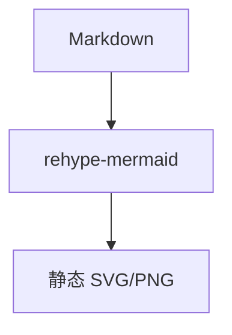
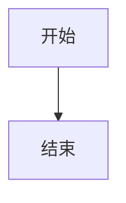

# Mermaid Conversation Transcript

- Prompt transcript: `C:\Users\Umamichi\.cursor\projects\c-Users-Umamichi-Desktop-umamichi-moe\agent-transcripts\ece5dc9e-a1fe-459d-a44d-8e258618dc26\ece5dc9e-a1fe-459d-a44d-8e258618dc26.jsonl`
- Scope: user-visible conversation messages from the Cursor agent session (2026-06-20); excludes system/developer instructions and tool payload internals.
- Related implementation: `astro.config.mjs`, `package.json`, `README.md`, `src/components/BaseHead.astro`, `src/components/SiteChromeScripts.astro`, `src/styles/article-content.css`, `src/content/blog/first-post.md`.

> 以下转录由 Cursor Agent（Auto）整理自同一会话记录；用户消息与助手回复正文按出现顺序保留原文，不含工具调用细节。

---

## 1. User

参考 https://blog.ixiaocai.net/posts/Astro-Blog-Customize-1-Adding-MarkDown-Mermaid-Support/，如何为本项目引入 Mermaid 支持？

---

## 2. Assistant

我先查看参考文章的做法，并对照本项目的 Markdown/Astro 配置。

---

## 3. Assistant

你的项目已在 `src/content/index.md` 里把 Mermaid 列为待办；当前 **Astro 6.1.3** 已具备比 [XiaoCai 的文章](https://blog.ixiaocai.net/posts/Astro-Blog-Customize-1-Adding-MarkDown-Mermaid-Support/) 更简单的官方能力，不必完全照搬「关掉 Shiki + 手动 `rehypeShiki`」那套。

---

## 思路对比

| | XiaoCai 文章（2025-03） | 本项目推荐（Astro 5.5+ / 6.x） |
|---|---|---|
| 核心插件 | `rehype-mermaid` + Playwright | 相同 |
| 与 Shiki 冲突 | `syntaxHighlight: false`，再手动加 `rehypeShiki` | `syntaxHighlight.excludeLangs: ['mermaid']`，保留现有双主题 Shiki |
| 渲染时机 | 构建时在 Node 里用无头浏览器生成 SVG/PNG | 相同（零客户端 Mermaid JS） |

你现在的 Markdown 管道在 `astro.config.mjs` 里大致是：

```44:53:c:\Users\Umamichi\Desktop\umamichi.moe\astro.config.mjs
  markdown: {
    shikiConfig: {
      themes: {
        light: 'github-light',
        dark: 'github-dark',
      },
    },
    remarkPlugins: [remarkGfm, remarkMath, remarkContentAssetUrls],
    rehypePlugins: [rehypeContentAssetUrls, rehypeKatex, rehypeWrapEmoji],
  },
```

内容全是 `.md`（content collection），走 `markdown.*` 配置即可；`@astrojs/mdx` 虽已启用，但 `src/content/` 里目前没有 `.mdx`。

---

## 步骤 1：安装依赖

```bash
npm install rehype-mermaid playwright
npx playwright install chromium
```

- `rehype-mermaid` 在 Node 端用 Playwright 把 ` ```mermaid ` 代码块渲染成静态图/SVG。
- Linux CI 上若缺系统库，再用 `npx playwright install --with-deps chromium`；Windows 本地通常 `install chromium` 就够。
- 建议把 `playwright` 放在 `devDependencies`（仅构建时需要）。

---

## 步骤 2：改 `astro.config.mjs`

在现有配置上**增量**修改，保留 `shikiConfig` 和现有 remark/rehype 插件：

```javascript
import rehypeMermaid from 'rehype-mermaid';

// 可抽成常量，markdown 与 mdx 共用
const rehypePlugins = [
  [rehypeMermaid, { strategy: 'img-svg', dark: true }],
  rehypeContentAssetUrls,
  rehypeKatex,
  rehypeWrapEmoji,
];

export default defineConfig({
  // ...
  integrations: [
    mdx({
      remarkPlugins: [remarkGfm, remarkMath, remarkContentAssetUrls],
      rehypePlugins: [
        [rehypeMermaid, { strategy: 'img-svg', dark: true }],
        rehypeContentAssetUrls,
        rehypeWrapEmoji,
      ],
    }),
    // ...
  ],
  markdown: {
    shikiConfig: {
      themes: {
        light: 'github-light',
        dark: 'github-dark',
      },
    },
    syntaxHighlight: {
      type: 'shiki',
      // 默认已排除 math；显式写上以免被覆盖
      excludeLangs: ['mermaid', 'math'],
    },
    remarkPlugins: [remarkGfm, remarkMath, remarkContentAssetUrls],
    rehypePlugins,
  },
});
```

要点：

1. **`excludeLangs: ['mermaid']`**：让 Shiki 跳过 mermaid 块，留给 `rehype-mermaid` 处理（Astro 官方文档：[markdown.syntaxHighlight.excludeLangs](https://docs.astro.build/en/reference/configuration-reference/#markdownsyntaxhighlightexcludelangs)）。
2. **`rehypeMermaid` 放在自定义 rehype 插件最前**：与文章一致，在其它 HTML 变换之前处理代码块。
3. **MDX 也要加**：你在 `mdx({ rehypePlugins: [...] })` 里单独列了插件，不会自动继承 `markdown.rehypePlugins` 的全部内容；以后写 `.mdx` 时也需要同一套配置。

`strategy: 'img-svg'` + `dark: true` 会生成 `<picture>`，内含亮色 `` 和暗色 `<source media="(prefers-color-scheme: dark)">`，与 XiaoCai 文章一致。

---

## 步骤 3：适配本站的手动主题切换

本站不是纯 `prefers-color-scheme`，而是用 `html.dark` / `localStorage` 手动切换（见 `SiteChromeScripts.astro` 的 `applyThemePreference`）。  
`rehype-mermaid` 的暗色图默认靠 **媒体查询**，手动切主题时要用 JS 改 `<source id^="mermaid-dark">` 的 `media`，文章里的做法仍然适用：

```javascript
function updateMermaidMedia(preference) {
  const mediaMap = {
    system: '(prefers-color-scheme: dark)',
    dark: 'all',
    light: 'none',
  };
  document.querySelectorAll('[id^="mermaid-dark"]').forEach((el) => {
    el.setAttribute('media', mediaMap[preference] ?? 'none');
  });
}
```

在 `applyThemePreference` 末尾、`site:theme-change` 派发之后调用一次；`BaseHead.astro` 里首屏防闪脚本也可在设置 `html.dark` 后同步调用，避免 Mermaid 图先亮后暗。

Giscus 已有 `site:theme-change` 监听，Mermaid 可复用同一事件，不必再绑一次按钮。

---

## 步骤 4：样式（`article-content.css`）

文章建议的两处，对本项目仍然有效：

```css
/* Mermaid 图居中（picture 默认偏左） */
.article-content picture {
  display: flex;
  justify-content: center;
}

/* 若将来有全局 svg 规则，排除 mermaid */
.article-content svg:not([id^="mermaid"]) {
  /* ... */
}
```

当前 `article-content.css` 里的 `svg` 规则只作用于标题锚点复制按钮，暂无冲突；`.article-content img` 的居中样式对 Mermaid 的 `` 也有帮助。

---

## 步骤 5：在 Markdown 里写图

```markdown

```

构建或 dev 时由 Playwright 渲染，**页面不加载 mermaid.js**，符合文章「尽量不向客户端加 JS」的目标。

---

## 构建与部署注意

1. **本地 / CI 必须能跑 Playwright**：`npm run build` 时会启动 Chromium；未安装浏览器会报 `Executable doesn't exist`。
2. **Cloudflare Workers 部署**：Mermaid 在 **构建阶段** 完成，产物是静态 HTML/图片，Worker 运行时不需要 Playwright。关键是 **构建环境**（本机或 GitHub Actions 等）要装好 Chromium，而不是 Cloudflare 边缘节点。
3. **构建会变慢**：每页有 Mermaid 就会起浏览器渲染，文章里也提到过这一点。
4. **复制 Markdown**：现有 `ArticleSourceActions` 导出的是源码，` ```mermaid ` 块会原样保留，行为合理。

---

## 与 XiaoCai 方案的差异小结

- **不必** `syntaxHighlight: false` + 手动 `import { rehypeShiki } from '@astrojs/markdown-remark'`（Astro 6 用 `excludeLangs` 更干净）。
- **仍需** Playwright + `rehype-mermaid` + 手动主题 JS（本站有主题按钮）。
- **插件顺序、CSS、`picture` 暗色逻辑** 与文章一致。

---

## 验收清单

1. 在某篇 `src/content/**/*.md` 里加一段 ` ```mermaid `，跑 `npm run dev` 看是否出图而非高亮代码块。
2. 切换浅色/深色/跟随系统，确认 Mermaid 图跟着变。
3. 跑 `npm run build`，确认 CI/本机构建通过且无 Playwright 路径错误。

如果你希望我在 Agent 模式下直接改配置、加主题 JS 和 CSS，可以说一声我来做。

---

## 4. User

请问什么叫“零客户端 Mermaid JS”？

---

## 5. Assistant

“零客户端 Mermaid JS”指的是：**访客打开页面时，浏览器里不需要再加载、执行 Mermaid 的 JavaScript 库**。

## 两种做法对比

**客户端渲染（不是零客户端）**

Markdown 里仍是一段 ` ```mermaid ` 文本。页面加载后，浏览器还要：

1. 下载 `mermaid.js`（体积不小）
2. 在客户端解析这段文本
3. 在 DOM 里画成 SVG

很多「在 Astro 里加 Mermaid」的简易方案走这条路：构建时只保留代码块，运行时靠 `<script>` 调用 `mermaid.initialize()`。页面能出图，但**依赖客户端 JS**。

**构建时渲染（零客户端 Mermaid JS）**

用 `rehype-mermaid` + Playwright 时，流程是：

1. `npm run build` / dev 渲染 Markdown 时，在 **Node 端**用无头 Chromium 把 Mermaid 画好
2. 输出的是静态 HTML：`<picture>`、`` 或内联 `<svg id="mermaid-0">`
3. 访客只看到已经生成好的图，**不必再加载 mermaid.js**

所以叫「零客户端 Mermaid JS」：**Mermaid 的解析和绘图在构建/服务端完成，不在用户浏览器里跑 Mermaid 库**。

## 和「完全不向页面加 JS」的区别

之前说的「尽量不向客户端加 JS」主要指 **Mermaid 本身**；本站仍有主题切换等脚本，那是另一回事。

`rehype-mermaid` 若开 `dark: true`，手动切主题时可能要改 `<source media="...">`，那是**几行站点已有逻辑的延伸**，不是整份 Mermaid 运行时。

## 一句话

**零客户端 Mermaid JS** = 图在构建时已经画进 HTML，访客浏览器只显示结果，不需要再跑 Mermaid 的 JS。

---

## 6. User

请用官方方式实施

---

## 7. Assistant

按 Astro 官方推荐方式接入 Mermaid：先查看当前配置与主题脚本，再安装依赖并改配置。

---

## 8. User

请继续

---

## 9. Assistant

继续完成 Mermaid 集成：先检查当前进度，再安装 Playwright 并验证构建。

---

## 10. Assistant

依赖与配置已就绪，正在安装 Playwright Chromium 并验证构建。

---

## 11. Assistant

构建已通过。正在用一段 Mermaid 做端到端渲染验证。

---

## 12. Assistant

Mermaid 已按 Astro 官方推荐方式接入，当前状态如下。

## 已完成

**依赖**
- `rehype-mermaid`（运行时）
- `playwright`（devDependencies，构建时渲染用）
- 已执行 `npx playwright install chromium`

**`astro.config.mjs`**
- `syntaxHighlight.excludeLangs: ['mermaid', 'math']`，让 Shiki 跳过 Mermaid 块
- `rehypeMermaid`（`strategy: 'img-svg'`, `dark: true`）加入 Markdown 与 MDX 的 rehype 链

**主题适配**
- `BaseHead.astro`：首屏在 DOM 就绪后同步 Mermaid 暗色 `<source media>`
- `SiteChromeScripts.astro`：切换主题时调用 `updateMermaidMedia`

**样式**
- `article-content.css`：`.article-content picture` 居中

**验证**
- `npm run build` 成功
- `npm test` 20 项全部通过

## 用法

在任意 `src/content/**/*.md` 中写：

````markdown

````

构建时会在 Node 端渲染为静态 SVG 图，页面不加载 mermaid.js。

## 新环境注意

克隆仓库后除 `npm install` 外，还需一次：

```bash
npx playwright install chromium
```

否则含 Mermaid 的页面在 `npm run build` 时会因找不到浏览器而失败。

## 构建警告

Astro 6.4+ 提示 `markdown.rehypePlugins` / `mdx.rehypePlugins` 已弃用，建议改到 `unified({...})` 的 `markdown.processor`。当前仍可正常工作，若要消除警告可另开一次迁移。

主页待办里的「支持 Mermaid」如需我顺手删掉或改成已完成的说明，可以说一声。

---

## 13. User

请把“克隆仓库后除 npm install 外，还需一次：
npx playwright install chromium
...”写进项目 README.md 里

---

## 14. Assistant

已在 README 的「本地开发」一节补充说明：克隆后除 `npm install` 外还需执行 `npx playwright install chromium`，并简要说明这是 Mermaid 构建时渲染所需。命令示例也已更新为三步顺序。

---

## 15. User

请在 first-post.md 中添加一个 mermaid 的示例，这次以 HRT 为主题，但是不要过于露骨

---

## 16. Assistant

在 `first-post.md` 的排版测试区加入一节 Mermaid 示例，以医疗照护路径呈现 HRT，避免露骨描述。

---

## 17. Assistant

已在 `src/content/blog/first-post.md` 的「代码测试」与「Utau 角色对比」之间加入 **Mermaid 测试** 一节。

内容要点：
- 用引用块说明：这是 HRT 照护路径的示意，具体须遵医嘱
- 流程图涵盖：了解背景 → 咨询 → 评估 → 方案/观察 → 用药 → 复诊监测 → 记录变化 → 调整或长期随访
- 不涉及身体细节或露骨描述，整体偏医疗流程表述

构建已通过，`/blog/first-post/` 页面中 Mermaid 图已正常渲染为 SVG。

---

## 18. User

请提交

---

## 19. Assistant

已提交，提交号为 `404418d`：

**feat: add build-time Mermaid support for Markdown by vibe coding**

包含 8 个文件：
- `astro.config.mjs`、`package.json`、`package-lock.json`：Mermaid / Playwright 集成
- `BaseHead.astro`、`SiteChromeScripts.astro`：暗色主题下图表切换
- `article-content.css`：Mermaid 图居中
- `README.md`：Playwright Chromium 安装说明
- `first-post.md`：HRT 照护路径示例图

未纳入提交的 `worker-configuration.d.ts` 为本地生成文件（按 AGENTS.md 惯例不提交）。

当前分支比 `origin/main` 超前 1 个提交；需要推送时说一声。

---

## 20. User

请补全 primary prompts，并去掉请继续

---

## 21. Assistant

README 那条 prompt 仍含省略号，正在改为完整原文并再次 amend。

---

## 22. Assistant

已 amend 提交 `e7d98f9`，`primary prompts` 现为：

- 参考 XiaoCai 博文，如何引入 Mermaid 支持
- 请用官方方式实施
- README 中 Playwright 安装说明（已补全，去掉 `...`）
- first-post 的 HRT 示例图
- 请提交
- 请补全 primary prompts，并去掉请继续

已删除「请继续」。`Co-authored-by` trailer 仍保留。

---

## 23. User

请把聊天记录全文原文转录进 docs/ 下的 md 文件，然后 --amend 提交
