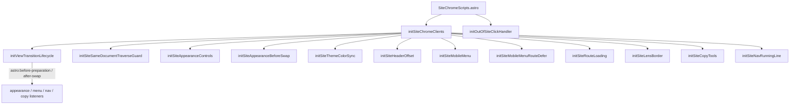

# Site chrome 客户端模块图

> 以下内容为 Composer 辅助编写，未全部经人工逐行核对；以仓库源码为准，请谨慎对待。

维护用说明（非站内页面）。描述全站外壳脚本如何从 Astro 入口初始化，以及与出站链接拦截的关系。

## 入口

[`src/components/SiteChromeScripts.astro`](../src/components/SiteChromeScripts.astro) 内有两个并行 `<script>`：

1. `initSiteChromeClients()`（[`src/lib/site-chrome-init.ts`](../src/lib/site-chrome-init.ts)）— 导航、外观、移动菜单、复制归因等。
2. `initOutOfSiteClickHandler(...)`（[`src/lib/out-of-site-click-client.ts`](../src/lib/out-of-site-click-client.ts)）— 全站外链拦截；详见 [`out-of-site-interstitial.md`](./out-of-site-interstitial.md)。

## 初始化顺序

`initSiteChromeClients` 的调用顺序即依赖顺序的大致约定：先生命周期，再外观/布局，再菜单与导航装饰，最后复制工具。

## 模块职责（简表）

| 模块 | 作用 |
|------|------|
| `view-transition-lifecycle.ts` | 统一注册 `astro:after-swap` / `before-preparation` / `before-swap` |
| `site-same-document-traverse.ts` | 同文档遍历守卫 |
| `site-appearance-client.ts` / `site-appearance-before-swap.ts` / `site-theme-color-client.ts` | 主题/外观与 theme-color |
| `site-header-offset-client.ts` | 顶栏高度 CSS 变量 |
| `site-mobile-menu-client.ts` / `site-mobile-menu-route-defer.ts` | 移动菜单与路由延迟关菜单 |
| `site-route-loading-client.ts` | 路由加载态 |
| `site-lens-border-client.ts` | 镜头边框装饰 |
| `site-copy-tools-client.ts` | 选区复制归因 toast、文章源码菜单 |
| `site-nav-running-line-client.ts` | 桌面/移动导航 running line 与图标色调 |

## 测试与覆盖率

Chrome clients 以 DOM / View Transitions 为主，当前 Vitest 覆盖率刻意 **排除** `*-client.ts`（见根目录 `vitest.config.ts`）。行为正确性优先本地 `npm run dev` 手测。纯逻辑（如 `path-slashes`、`out-of-site-payload`、`docs`）用 `npm test` / `npm run test:coverage`。

## 日后把 LCOV 接到 SonarCloud

见根目录 [`sonar-project.properties`](../sonar-project.properties) 文末说明：需关闭 Automatic Analysis，再在 CI 中跑 `npm run test:coverage` 后执行 scanner。本仓库暂不提交 Sonar GitHub Action。
