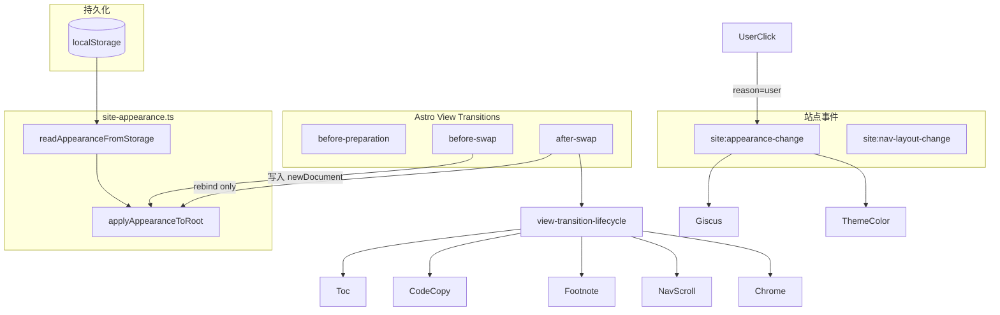
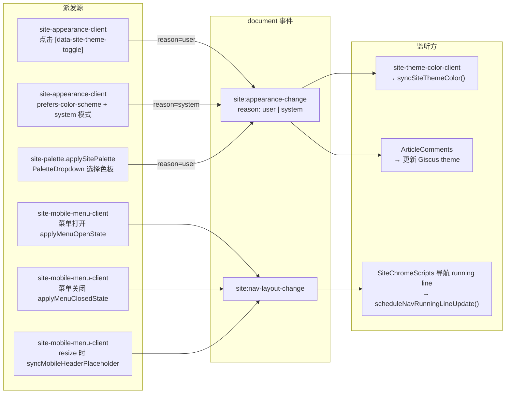
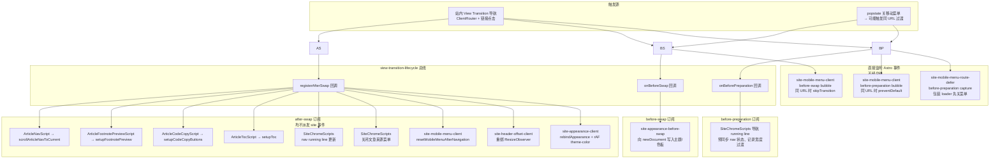

# Site Events Refactor Conversation Transcript

- Prompt transcript: C:\Users\Umamichi\.cursor\projects\c-Users-Umamichi-Desktop-umamichi-moe\agent-transcripts\0659d028-a5c9-46de-a1b3-51aa7bfb85ed\0659d028-a5c9-46de-a1b3-51aa7bfb85ed.jsonl
- Scope: user-visible conversation messages from the Cursor agent session (2026-06-29); excludes system/developer instructions and tool payload internals.
- Related implementation: src/lib/site-appearance.ts, src/lib/site-appearance-client.ts, src/lib/site-events.ts, src/lib/view-transition-lifecycle.ts, src/lib/site-chrome-init.ts, src/lib/site-theme-color.ts, src/lib/site-header-offset-client.ts, and related component updates.

> 以下转录由 Cursor Agent（Auto）整理自同一会话记录；用户消息与助手回复正文按出现顺序保留原文，不含工具调用细节。

---

## 1. User

请全面排查全站 astro: 和 site: 事件的冗余、非单一职责逻辑、时机不当的情况，并提出整改方案
</user_query>

## 2. Assistant

以下是对全站 `astro:*` 与 `site:*` 客户端事件的排查结论与整改建议。范围限于 **View Transitions 生命周期** 与 **站点自定义 document 事件**（不含 `astro:content`、`astro:middleware`、构建钩子等）。

---

## 一、事件全景

### Astro View Transitions（客户端）

| 事件 | 监听位置 | 职责 |
|------|----------|------|
| `astro:before-preparation` | `site-mobile-menu-route-defer.ts`（capture） | 菜单打开时包装 `loader`，先关菜单再导航 |
| | `site-mobile-menu-client.ts` | popstate 关菜单时 `preventDefault` 跳过同 URL 过渡 |
| | `SiteChromeScripts.astro`（导航 running line） | 预同步 nav 状态、记录宽度过渡起点 |
| `astro:before-swap` | `site-appearance-before-swap.ts` | 向 `newDocument` 写入主题/色板、复制 `theme-color` meta |
| | `site-mobile-menu-client.ts` | 同 URL 跳过时 `skipTransition()` |
| `astro:after-swap` | **10 处独立监听**（见下） | 各模块自行 re-init |

`astro:after-swap` 监听清单：

1. `SiteChromeScripts` — 重应用主题（含发 `site:theme-change`）
2. `SiteChromeScripts` — 重应用色板（**不发事件**）
3. `SiteChromeScripts` — `ResizeObserver` 重绑 header
4. `SiteChromeScripts` — 关闭文章来源菜单
5. `SiteChromeScripts` — 导航 running line 更新
6. `site-mobile-menu-client.ts` — 清菜单 history、强制关菜单
7. `ArticleTocScript.astro` — `setupToc`
8. `ArticleCodeCopyScript.astro` — `setupCodeCopyButtons`
9. `ArticleFootnotePreviewScript.astro` — `setupFootnotePreview`
10. `ArticleNavScript.astro` — `scrollArticleNavToCurrent`

### 站点自定义事件（`site:*`）

| 事件 | 派发 | 监听 |
|------|------|------|
| `site:theme-change` | `SiteChromeScripts.applyThemePreference` | `site-theme-color-client.ts`、`ArticleComments.tsx` |
| `site:palette-change` | `site-palette.applySitePalette` | 同上 |
| `site:nav-layout-change` | `site-mobile-menu-client`（开/关菜单） | `SiteChromeScripts` 导航 running line |

---

## 二、问题诊断

### 1. 外观逻辑三处重复（严重冗余）

主题/色板的「读 localStorage → 写 `documentElement`」至少有三份实现：

| 位置 | 时机 | 是否发事件 |
|------|------|------------|
| `BaseHead.astro` 内联脚本 | 首屏 FOUC 防护 | 否 |
| `SiteChromeScripts` 内联 | 首载 + 每次 `after-swap` | 主题发 `site:theme-change`，色板不发 |
| `site-appearance-before-swap.ts` | 每次 `before-swap` | 否 |

```27:45:src/lib/site-appearance-before-swap.ts
export function applyStoredAppearanceToRoot(root: HTMLElement): void {
	const preference = getStoredThemePreference();
	const resolved = getResolvedTheme(preference);
	// ... classList / dataset / colorScheme / palette
}
```

```34:52:src/components/SiteChromeScripts.astro
const applyThemePreference = (preference) => {
	// ... 同样的 classList / dataset / colorScheme
	document.dispatchEvent(new CustomEvent('site:theme-change', { detail: { preference, resolved } }));
	// + mermaid、按钮 aria-label
};
```

`getStoredThemePreference` / `getResolvedTheme` 在 `site-appearance-before-swap.ts` 与 `SiteChromeScripts` 中各写一遍；色板读取在 `site-palette.ts`、`SiteChromeScripts.applyStoredPalette`、`BaseHead` 内联脚本中各写一遍。

**后果**：改 storage key 或解析规则要改多处；`before-swap` 与 `after-swap` 对同一 document 重复写 DOM。

---

### 2. `site:theme-change` / `site:palette-change` 语义不一致（时机不当）

**主题**：每次路由 `after-swap` 都会调用 `applyThemePreference`，从而 **无条件派发** `site:theme-change`，即使用户并未改主题。

```79:80:src/components/SiteChromeScripts.astro
document.addEventListener('astro:after-swap', () => applyThemePreference(getStoredThemePreference()));
applyThemePreference(getStoredThemePreference());
```

监听方把它当「外观已变」：

- `site-theme-color-client` → 重算 `meta[name="theme-color"]`
- `ArticleComments` → 重建 Giscus `theme` prop（可能触发 iframe 重载）

导航时主题未变却触发上述副作用，属于 **伪变更事件**。

**色板**：路径不对称。

- `applyStoredPalette`（`after-swap`）只改 `dataset`，**不发** `site:palette-change`
- `applySitePalette`（用户选择 + `PaletteDropdown` mount）**会发**事件

```88:100:src/components/SiteChromeScripts.astro
const applyStoredPalette = () => {
	// ... 只写 dataset，无 dispatchEvent
};
document.addEventListener('astro:after-swap', applyStoredPalette);
```

```50:53:src/components/PaletteDropdown.tsx
useEffect(() => {
	applySitePalette(getStoredSitePaletteId());
}, []);
```

带 `PaletteDropdown` 的页面在 React hydrate 时会再调一次 `applySitePalette`，**重复写 localStorage 并派发 `site:palette-change`**，与 `SiteChromeScripts` 的 `applyStoredPalette` 功能重叠。

---

### 3. `applyThemePreference` 职责过多（非单一职责）

一个函数同时负责：

1. `themeSwitching` 过渡标记
2. DOM class / dataset / `colorScheme`
3. Mermaid `<link media>` 同步
4. 派发 `site:theme-change`
5. 主题切换按钮 `aria-label` / `title`

导航 re-init 只需要 (2)(3)(5)，却连带触发 (4)，把「写 DOM」与「通知订阅者」绑死。

---

### 4. `theme-color` 双路径冗余

| 路径 | 时机 | 实现 |
|------|------|------|
| A | `before-swap` | `syncThemeColorMetaToDocument(oldDoc, newDoc)` — 从旧页 header 算色写入新文档 meta |
| B | `site:theme-change` / `site:palette-change` | `syncSiteThemeColor()` — 从当前页 header 算色写 meta |

导航一次可能：**before-swap 写 meta → after-swap 发 theme-change → 再算一遍 meta**。逻辑重复，且 A 依赖旧文档 header 在过渡中的 computed style，B 依赖新文档渲染后的 header，时序微妙。

---

### 5. `site:theme-change` + `site:palette-change` 监听重复

两处用 **同一 handler** 监听两个事件：

```44:45:src/lib/site-theme-color-client.ts
document.addEventListener('site:theme-change', runSync);
document.addEventListener('site:palette-change', runSync);
```

```12:13:src/components/ArticleComments.tsx
document.addEventListener("site:theme-change", syncGiscusTheme)
document.addEventListener("site:palette-change", syncGiscusTheme)
```

订阅方实际只关心「最终外观状态」（`themeResolved` + `dataset.palette`），不需要区分来源字段的两个事件名。

---

### 6. `astro:after-swap` 碎片化（10 个监听器）

文章页脚本（TOC、代码复制、脚注、侧栏滚动）模式一致：`setupX()` + `astro:after-swap` → `setupX()`。合理，但：

- 无统一入口，顺序未定义
- `SiteChromeScripts` 单文件内就有 **5 个** `after-swap` 监听
- 新增页面能力时容易再 copy 一段 `addEventListener`

---

### 7. `astro:before-preparation` 双监听（可接受但需文档化）

移动菜单在两个模块各挂 `before-preparation`：

- `site-mobile-menu-route-defer.ts`（capture）：延迟 loader
- `site-mobile-menu-client.ts`（bubble）：popstate 同 URL 时 `preventDefault`

职责不同，但 **执行顺序依赖 capture/bubble**，维护者不易看出先后关系。

---

### 8. `site:nav-layout-change` 覆盖不全（时机缺口）

仅在 `applyMenuOpenState` / `applyMenuClosedState` 时派发：

```78:91:src/lib/site-mobile-menu-client.ts
document.dispatchEvent(new Event('site:nav-layout-change'));
```

但 `resize` 时若菜单仍打开，会 `syncMobileHeaderPlaceholder(true)` **却不发** `site:nav-layout-change`：

```319:327:src/lib/site-mobile-menu-client.ts
window.addEventListener('resize', () => {
	// ...
	if (isMenuOpen() || isMenuClosing()) {
		syncMobileHeaderPlaceholder(true);
	}
}, { passive: true });
```

导航 running line 在菜单高度变化时可能短暂错位，直到下一次 resize（SiteChromeScripts 自己也监听了 resize，部分掩盖问题）。

---

### 9. `clearMenuHistoryAfterNavigation` 在 init 时立即执行

```337:338:src/lib/site-mobile-menu-client.ts
document.addEventListener('astro:after-swap', clearMenuHistoryAfterNavigation);
clearMenuHistoryAfterNavigation();
```

首载即关菜单合理；与 `after-swap` 共用同一函数，函数名暗示「导航后」但 init 也会跑——命名与语义略混。

---

## 三、整改方案（分阶段）

### 阶段 A：收敛外观单一数据源（优先）

新建 `src/lib/site-appearance.ts`（名称可调整），统一：

```typescript
// 概念 API（示意）
export const SITE_THEME_STORAGE_KEY = 'site-theme';
export function getStoredThemePreference(): ThemePreference;
export function getResolvedTheme(preference): 'light' | 'dark';
export function getStoredPaletteId(): string | null;
export function applyAppearanceToRoot(root: HTMLElement, state: AppearanceState): void;
export function readAppearanceFromStorage(): AppearanceState;
```

然后：

| 现位置 | 改为 |
|--------|------|
| `site-appearance-before-swap.ts` | 只 import 并调用 `applyAppearanceToRoot(newDocument.documentElement, readAppearanceFromStorage())` |
| `SiteChromeScripts` 内联主题/色板块 | 改为 import 模块，或保留极简内联 FOUC 块但 **常量与逻辑从同一模块生成** |
| `BaseHead` 内联 | 保留首屏 IIFE（避免阻塞），但 storage key 与解析规则与模块一致（可抽 `site-appearance-head-snippet` 构建时注入） |
| `site-palette.applySitePalette` | 只负责「用户改色板」：写 storage → `applyAppearanceToRoot` → 发事件 |

删除 `PaletteDropdown` mount 时的 `applySitePalette(getStoredSitePaletteId())`；全局 init 已足够。

---

### 阶段 B：统一事件模型

合并为单一事件（推荐）：

```typescript
// site:appearance-change
detail: {
  preference: 'light' | 'dark' | 'system';
  resolved: 'light' | 'dark';
  palette: string; // 'default' | palette id
  reason: 'user' | 'system' | 'navigation';
}
```

规则：

| `reason` | 何时派发 | 订阅方行为 |
|----------|----------|------------|
| `user` | 点击主题/色板 | Giscus 换肤、theme-color 同步 |
| `system` | `prefers-color-scheme` 变化且 preference 为 system | 同上 |
| `navigation` | **默认不派发**；仅内部 rebind | — |

导航 `after-swap` 改为：

```typescript
function rebindAppearanceAfterNavigation() {
  const state = readAppearanceFromStorage();
  applyAppearanceToRoot(document.documentElement, state); // 幂等
  syncMermaidMedia(state.preference);
  syncThemeToggleLabels(state.resolved);
  syncSiteThemeColor(); // 直接调用，不经事件
  // 不 dispatch site:appearance-change
}
```

`ArticleComments` 改为：

- mount 时读一次 `getGiscusThemeUrl()`
- 只监听 `reason === 'user' | 'system'` 的 `site:appearance-change`
- 或监听 `astro:after-swap` 仅在评论区 DOM 存在时刷新（二选一，避免双通道）

过渡期可保留 `site:theme-change` / `site:palette-change` 作 alias，内部转发到 `site:appearance-change`。

---

### 阶段 C：合并 `theme-color` 同步

只保留 **一个** `syncSiteThemeColor(doc?: Document)`：

- `before-swap`：对 `newDocument` 调用（或在 swap 后统一调用，二选一，不要两条链都做）
- 用户改外观：在 `applySitePalette` / 用户切主题后直接调用，**不依赖事件链**

推荐：**去掉** `before-swap` 里从旧文档 header 复制颜色的逻辑，改为 `after-swap` 末尾 `requestAnimationFrame(syncSiteThemeColor)`，此时新 header 已 persist 且样式稳定。可消除跨文档 `getComputedStyle` 的时序风险。

---

### 阶段 D：集中 View Transition 钩子

新建 `src/lib/view-transition-lifecycle.ts`：

```typescript
const afterSwapCallbacks = new Set<() => void>();

export function onAfterSwap(fn: () => void): () => void {
  afterSwapCallbacks.add(fn);
  return () => afterSwapCallbacks.delete(fn);
}

export function initViewTransitionLifecycle(): void {
  document.addEventListener('astro:after-swap', () => {
    for (const fn of afterSwapCallbacks) fn();
  });
}
```

各模块注册而非各自 `addEventListener`：

```typescript
// site-mobile-menu-client.ts
onAfterSwap(clearMenuHistoryAfterNavigation);

// ArticleTocScript → 抽成 initArticleToc() 注册
```

`SiteChromeScripts` 内 5 个 listener 合并为 1 个 `reinitSiteChromeAfterSwap()`，内部按序调用。

可选：对文章页 setup 提供 `onAfterSwap(setupArticleInteractive, { selector: 'main.article' })` 避免无关节点执行。

---

### 阶段 E：拆分 `applyThemePreference` 职责

```typescript
function applyThemeToRoot(preference) { /* 仅 DOM + dataset */ }
function syncThemeChrome(preference, resolved) { /* mermaid + 按钮 aria */ }
function notifyThemeChange(detail, reason) { /* 仅 reason !== 'navigation' 时 dispatch */ }

// 用户点击
function onUserThemeToggle() {
  const next = ...;
  localStorage.setItem(...);
  const resolved = applyThemeToRoot(next);
  syncThemeChrome(next, resolved);
  notifyThemeChange({ preference: next, resolved }, 'user');
  syncSiteThemeColor();
}
```

---

### 阶段 F：小修补

1. **`site:nav-layout-change`**：在 `syncMobileHeaderPlaceholder` 改变 `--site-header-placeholder-height` 后也派发；或改为 `ResizeObserver` 观察 mobile menu/header。
2. **`site-mobile-menu` 两个 `before-preparation`**：在同一文件或 `CONTEXT.md` 注明 capture 顺序与 `preventDefault` 互斥条件。
3. **重命名** `clearMenuHistoryAfterNavigation` → `resetMobileMenuAfterNavigation`（init 与 swap 共用更准确）。
4. **类型**：为 `site:*` 事件写 `SiteCustomEventMap` 声明合并，替代各处 `CustomEvent & { newDocument?: Document }` 断言。

---

## 四、优先级建议

| 优先级 | 项 | 收益 | 工作量 |
|--------|-----|------|--------|
| P0 | 外观逻辑单模块 + 去掉导航伪 `theme-change` | 减 bug、减 Giscus 无谓重载 | 中 |
| P0 | 删除 `PaletteDropdown` mount 重复 `applySitePalette` | 减重复事件与 storage 写 | 小 |
| P1 | 合并 `site:appearance-change` | 订阅方简化 | 中 |
| P1 | `theme-color` 单路径 | 去掉 before/after 双写 | 小 |
| P2 | `view-transition-lifecycle` 集中注册 | 可维护性 | 中 |
| P2 | `site:nav-layout-change` 补全 resize | 修 running line 边角 | 小 |

---

## 五、目标架构（示意）



---

## 六、不必改动的部分

- 文章脚本「`setup` + `after-swap`」模式本身正确，问题是缺集中注册而非模式错误。
- `site-mobile-menu-route-defer` 用 `before-preparation` 包装 `loader` 是 Astro 推荐做法，职责清晰。
- `BaseHead` 首屏内联脚本为 FOUC 可保留，但应与模块共享常量/规则，而非再复制第三套逻辑。

---

当前为 **Ask 模式**，以上仅为分析与方案。若需要我按阶段 A→B 直接改代码，可切换到 Agent 模式并指定优先阶段。

[REDACTED]

## 3. User

请实施 A-F
</user_query>

## 4. Assistant

已完成 A–F 全阶段整改，`npm run build` 通过。摘要如下：

## A：外观单一数据源

新建 `src/lib/site-appearance.ts`，统一 storage key、读取、写入 DOM、Mermaid 同步、主题切换按钮文案。

- `site-appearance-before-swap.ts`、`site-palette.ts`、`BaseHead.astro` 均改为使用该模块
- 删除 `SiteChromeScripts` 内联主题/色板逻辑，改由 `site-appearance-client.ts` 驱动

## B：统一事件 `site:appearance-change`

新建 `src/lib/site-events.ts`：

- 派发 `site:appearance-change`，`detail` 含 `preference` / `resolved` / `palette` / `reason`
- 仅 `reason: 'user' | 'system'` 时通知订阅方
- 路由 `after-swap` 只 rebind DOM，**不派发事件**
- 移除 `site:theme-change`、`site:palette-change`
- `ArticleComments`、`site-theme-color-client` 改为监听新事件

## C：`theme-color` 单路径

- 逻辑集中在 `src/lib/site-theme-color.ts`
- 删除 `before-swap` 跨文档复制 meta 的逻辑
- 用户改外观 → 事件监听同步；导航后 → `requestAnimationFrame(syncSiteThemeColor)`

## D：View Transition 生命周期集中

新建 `src/lib/view-transition-lifecycle.ts` + `site-chrome-init.ts`：

- 单一 `astro:after-swap` / `astro:before-preparation` / `astro:before-swap` 分发器
- 模块侧用 `registerAfterSwap` / `onBeforeSwap`
- 内联脚本通过 `window.__siteRegisterAfterSwap` / `__siteRegisterBeforePreparation` 注册
- `site-header-offset-client.ts` 从 inline 抽出

## E：职责拆分

- `applyAppearanceToRoot` — 仅 DOM
- `syncMermaidMedia` / `syncThemeToggleLabels` — chrome 同步
- `markThemeSwitchingTransition` — 过渡标记
- `dispatchSiteAppearanceChange` — 仅用户/系统变更时通知

## F：小修补

- `clearMenuHistoryAfterNavigation` → `resetMobileMenuAfterNavigation`
- 菜单 `resize` 更新 placeholder 时派发 `site:nav-layout-change`
- `site-mobile-menu-route-defer.ts` 补充 capture/bubble 顺序说明
- `DocumentEventMap` 类型声明（`site-events.ts`）
- 删除 `PaletteDropdown` mount 时重复的 `applySitePalette`

### 新文件结构

| 文件 | 职责 |
|------|------|
| `site-appearance.ts` | 外观状态读写与 DOM 应用 |
| `site-appearance-client.ts` | 主题控件、导航 rebind |
| `site-appearance-before-swap.ts` | `before-swap` 写入新文档 |
| `site-events.ts` | 自定义事件类型与派发 |
| `site-theme-color.ts` | `meta[name="theme-color"]` 同步 |
| `view-transition-lifecycle.ts` | Astro 过渡生命周期总线 |
| `site-chrome-init.ts` | 站点 chrome 统一初始化入口 |
| `site-header-offset-client.ts` | header offset 观测 |

首屏 FOUC 防护仍保留在 `BaseHead` 内联脚本，storage key 通过 `define:vars` 从 `site-appearance.ts` 注入，避免硬编码分叉。

[REDACTED]

## 5. User

请画出现在站点间事件、事件触发源的关系图
</user_query>

## 6. Assistant

整改后，站点事件分为两层：**Astro View Transitions 框架事件**（由 `ClientRouter` 在站内导航时触发）和 **站点自定义 `site:*` 事件**（由业务逻辑主动派发）。中间通过 `view-transition-lifecycle.ts` 做集中分发。

---

## 总览：两层事件 + 生命周期总线

```mermaid
flowchart TB
  subgraph triggers [触发源]
    U1[用户点击主题切换按钮]
    U2[用户选择色板 PaletteDropdown]
    U3[系统 prefers-color-scheme 变化<br/>且主题为 system]
    U4[用户站内链接导航]
    U5[移动菜单开/关/resize 占位]
    U6[首屏加载 BaseHead 内联脚本]
  end

  subgraph astro [Astro 框架事件]
    BP[astro:before-preparation]
    BS[astro:before-swap]
    AS[astro:after-swap]
  end

  subgraph bus [view-transition-lifecycle 总线]
    BPbus[beforePreparationCallbacks]
    BSbus[beforeSwapCallbacks]
    ASbus[afterSwapCallbacks]
  end

  subgraph site [站点自定义事件]
    SAC[site:appearance-change<br/>detail.reason: user | system]
    SNC[site:nav-layout-change]
  end

  U4 --> BP & BS & AS

  BP --> BPbus
  BS --> BSbus
  AS --> ASbus

  U1 --> SAC
  U2 --> SAC
  U3 --> SAC
  U5 --> SNC
  U6 -.->|直接写 DOM，不发事件| DOM[(document.documentElement)]
```

---

## 一、`site:*` 自定义事件：派发源 → 监听方



要点：

- `site:appearance-change` 的 `reason` 类型含 `navigation`，但**当前代码从不派发**；路由 `after-swap` 只做 DOM rebind + `rAF(syncSiteThemeColor)`，不走事件。
- `L1`、`L2` 均通过 `isAppearanceChangeForSubscribers()` 过滤，只响应 `user` / `system`。
- 首屏 `BaseHead` 内联脚本写主题/色板到 DOM，**不派发**任何 `site:*` 事件。

---

## 二、`astro:*` 框架事件：触发源与订阅关系



`before-preparation` 执行顺序（移动菜单相关）：

1. **capture**：`site-mobile-menu-route-defer` — 菜单打开时包装 `event.loader`
2. **bubble（总线）**：`SiteChromeScripts` 导航 running line
3. **bubble（直接）**：`site-mobile-menu-client` — popstate 同 URL 时 `preventDefault()`

---

## 三、非事件路径（同样影响外观，但不走 `site:*`）

| 路径 | 时机 | 行为 |
|------|------|------|
| `BaseHead.astro` 内联 | 首屏 FOUC 防护 | 直接写 `classList` / `dataset`，不发事件 |
| `site-appearance-client` 导航 rebind | `after-swap` | `applyAppearanceToRoot` + Mermaid + 按钮文案；`rAF(syncSiteThemeColor)` |
| `site-theme-color-client` 首屏 | `DOMContentLoaded` 或立即 | 直接 `syncSiteThemeColor()` |

---

## 四、初始化入口

所有 TS 侧 chrome 初始化经 `site-chrome-init.ts` → `initSiteChromeClients()`，在 `SiteChromeScripts.astro` 首段 `<script>` 调用；顺序为：

1. `initViewTransitionLifecycle()` — 挂载 Astro 总线  
2. `initSiteAppearanceControls()` — 主题控件 + `after-swap` rebind  
3. `initSiteAppearanceBeforeSwap()` — `before-swap` 写新文档  
4. `initSiteThemeColorSync()` — 监听 `site:appearance-change`  
5. `initSiteHeaderOffset()`  
6. `initSiteMobileMenu()` + `initSiteMobileMenuRouteDefer()`

内联脚本（文章 TOC、代码复制等）通过 `window.__siteRegisterAfterSwap` 注册；若总线尚未就绪，则回退为直接 `document.addEventListener('astro:after-swap', …)`。

---

## 五、事件清单速查

| 事件 | 派发者 | 监听者 | 备注 |
|------|--------|--------|------|
| `site:appearance-change` | 主题切换、系统配色变化、色板选择 | `site-theme-color-client`、`ArticleComments` | 仅 `user`/`system` 被订阅方处理 |
| `site:nav-layout-change` | 移动菜单开/关、header placeholder 变化 | `SiteChromeScripts` 导航 running line | 无 detail |
| `astro:before-preparation` | Astro 导航 | route-defer（capture）、menu-client（bubble）、总线→nav running line | 菜单与导航预处理 |
| `astro:before-swap` | Astro 导航 | menu-client（bubble）、总线→appearance-before-swap | 写入 `newDocument` 外观 |
| `astro:after-swap` | Astro 导航 | 生命周期总线 → 9 个 rebind 回调 | 不发 `site:appearance-change` |

若需要把某条路径（例如「从点击链接到 Giscus 是否换肤」）单独展开成时序图，可以指定场景我补一版。

---

## 7. User

请将新增的聊天记录完整全文转录进 docs 下新的 md 文件中，然后提交
</user_query>
