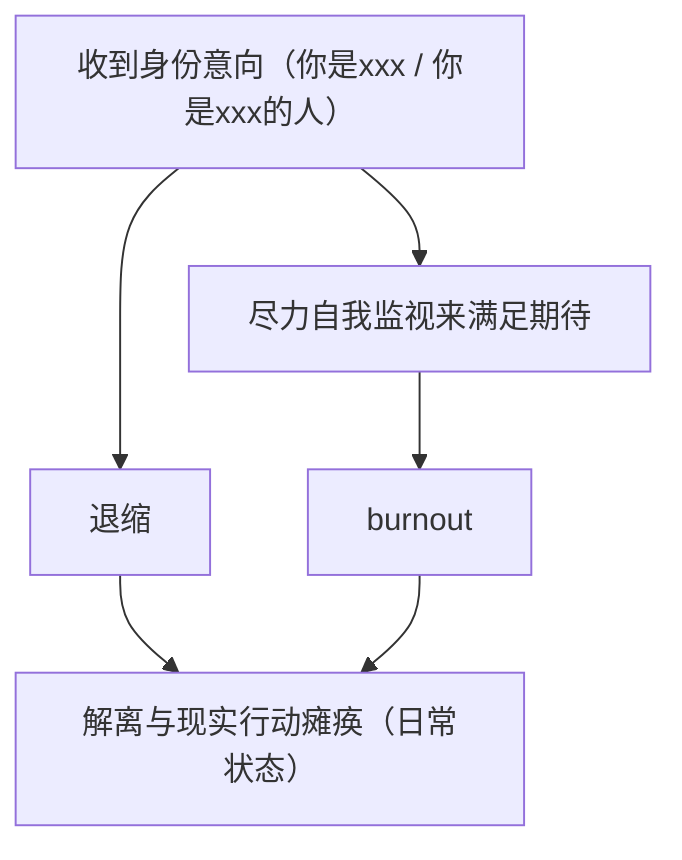

> 以下内容可能较为细节，如果不是很感兴趣可以跳过

## 特征

- 「无口系」：线下不擅长交流，可能更想打字
- 若显得冷漠无情：这是我本身的表达习惯，往往不是讨厌你或者你有问题。
  + 但是无意中可能伤到人。如果让你觉得不安，这是值得说出来的
- 说话风格比较谨慎
- 希望通过讨论具体的事物（如上面兴趣所述的事物）来交流
- 状态会周期性地变好和变差

### 身份意向与 burnout 循环

因此：

- 希望具体讨论做什么

请避雷：

- 我不是能保证 `availability` 的人，我可能不定期地消失，请不要将我作为一个可以在心理上单一依赖的人
  + 已知问题是消失期间对方往往会感到困扰/迷茫，而且关系越紧密这种效果就越强，这是一种常见和合理的反应，并不能说「你想多了」

### 解离与白日梦

- 常借白日梦想问题
- 会为幻想内容羞耻；社交时会 mock，以免影响外泄
  + 例如社交时突然想到幻想内容中的某个个人隐喻，导致与当前聊天内容不一致的情感反应，因为涉及到个人隐喻，所以万一发生这种情况很难解释。
- 我习惯通过笔记/存档来帮助维持连贯性。
