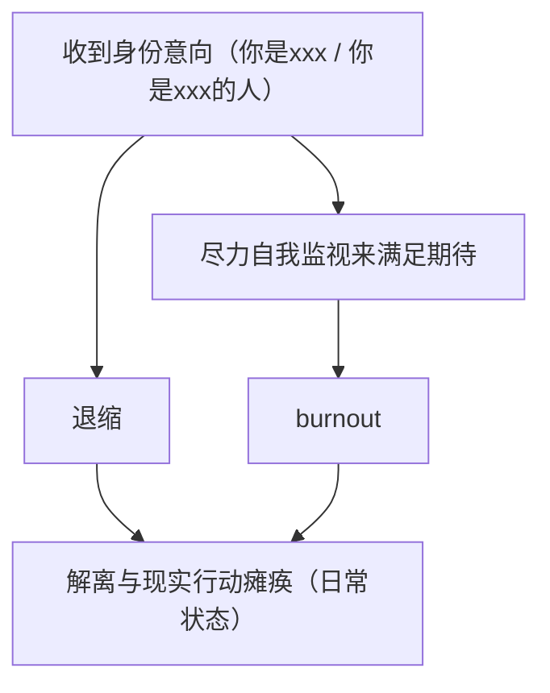

> 部分内容由 Cursor Auto 辅助编写，但经过我的审核

您好，我是 Umamichi，是大学毕业后正处于 gap year 状态的含🍥MtX[^1]。

## 词源学

- Uma：把 Ama（甘）的首字母换成 「U」，来与 「Unnamed2964」首字母保持一致。
- Umamichi 与 Umaichi 都正确，可交替使用。
- Umamichi 是刻板地按照正字法拼凑出来的词汇，读起来并不通顺，继续使用是出于历史沿革，所以不苛求能正确读出来。

## 兴趣

> 以下的内容仅代表感兴趣，不代表擅长

- 轨道交通
  + 我小时候会在纸上发展架空的城市及其地铁线路图作为白日梦
  + 对现实的铁路和地铁普遍感兴趣，主要关注东三省（小时候居住）以及长三角（目前居住）
- Windows 8-10
  + 尤其约 2012。站点风格里的确刻意靠近了 Windows 8 的设计
  + 是 Surface RT 1代的用户
- C++ / 算法竞赛
  + 虽然 OI 最高奖项只在黑龙江省获得了省二等奖
  + 曾尝试担任 C++ 语法警察，所以有段时间经常翻阅过 C++ reference
- 放送文化
  + 很长一段时间，我的作业 BGM 都是韩国/欧洲电视新闻节目 op/ed 合集
  + 我对电视台的「放送事故」尤为感兴趣
  + 我在 B 站上有一个[放送文化（含架空）](https://b23.tv/J04gvta)收藏夹（如果在手机版需要在 App 中打开后显示），里面收藏了一些放送文化相关的视频
- 函数式编程
  + 我曾对允许无限嵌套从句的语言产生了好感，这也适用于 lambda expression 上
- 形式化方法
  + 我正在刷 [Software Foundations](https://softwarefoundations.cis.upenn.edu/)，已基本完成 Logical Foundations、Programming Language Foundations 和 Verified Functional Algorithms 的机器判定题（`Admitted.` 数量≤10，三者在未修改时的 `Admitted.` 总数分别为415、269和232[^2]），正在做 Verifiable C，进度可见 [Unnamed2964/Software-Foundations-Checklist](https://github.com/Unnamed2964/Software-Foundings-Checklist)
  + 使用形式化验证语言（如这里提到的 Coq）进行证明的过程就是通过 tactics（一种指令），逐步构造证明 term 的过程。形式化验证工具的内核仅接受符合类型检查的证明 term，如果类型检查通过那么这个证明一定得证，否则不得证。这最大地避免了人际接触，而且任何人在安装相应工具链的电脑上都能复现，降低了验证门槛，**很大程度避免了单方面自称证明了 xxx 的情况**。
  + 我对自然语言的记叙文和议论文写作很吃力，形式化验证语言作为一类语言避免了这一短处
- ~~客家、犹太历史&文化~~
  + 打删除线的原因是，这可能对真正的客家人或（和）犹太人非常不敬！
  + 但是有朋友的确感兴趣这方面，所以仍放在这里
- 东北亚历史&文化
- 哲学；精神分析与精神病学（试着解释自己的体验，并了解其他人是怎么解释的）

## 特征

- 「无口系」：线下不擅长交流，可能更想打字
- 若显得冷漠无情：这是我本身的表达习惯，往往不是讨厌你或者你有问题。
  + 但是无意中可能伤到人。如果让你觉得不安，这是值得说出来的
- 说话风格比较谨慎
- 希望通过讨论具体的事物（如上面兴趣所述的事物）来交流

> **以下内容可能较为细节，如果不是很感兴趣可以跳过**

### 身份意向与 burnout 循环

因此：

- 希望具体讨论做什么

请避雷：

- 我不是能保证 `availability` 的人，我可能不定期地消失，请不要将我作为一个可以在心理上单一依赖的人
  + 已知问题是消失期间对方往往会感到困扰/迷茫，而且关系越紧密这种效果就越强，这是一种常见和合理的反应，并不能说「你想多了」

### 解离与白日梦

- 常借白日梦想问题
- 会为幻想内容羞耻；社交时会 mock，以免影响外泄
  + 例如社交时突然想到幻想内容中的某个个人隐喻，导致与当前聊天内容不一致的情感反应，因为涉及到个人隐喻，所以万一发生这种情况很难解释。
- 我习惯通过笔记/存档来帮助维持连贯性。

[^1]: 这里取对男性和女性身份都缺乏认同之意。但是我会穿 JK 制服等服装。
[^2]: Logical Foundations 和 Programming Language Foundations 均以所完成的 Version 6.9.0 版本为准，Verified Functional Algorithms 以所完成的 Version 1.6.0 版本为准。不同版本的题目数可能略有差异。
