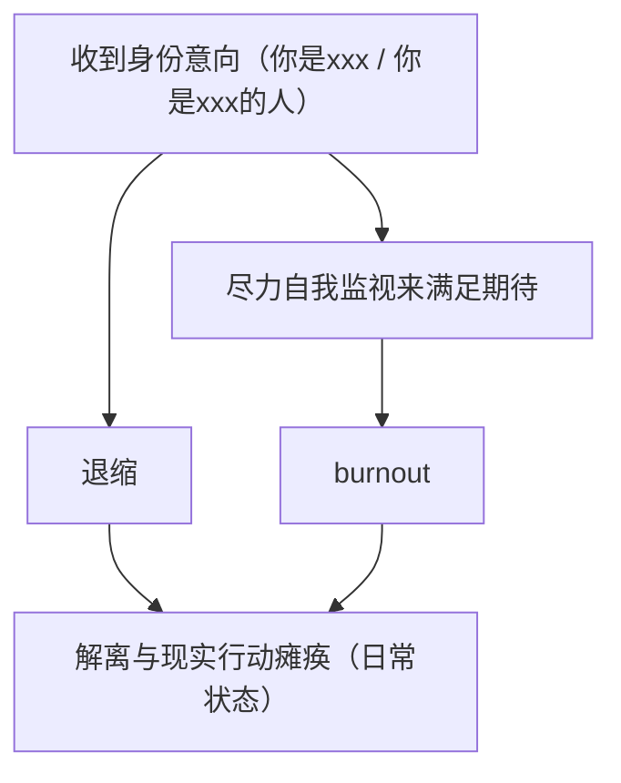

> 以下内容由 Cursor Auto 辅助编写,但经过我的审核
> 以下内容由上一版本(6e5d2f)由 Cursor Auto 按 Windows XP 发行说明体辅助改写
> 
> 常规自我介绍见 [关于](/about/)。

## 关于本版本的重要信息

本发行将 Umamichi 描述为：**大学毕业后、正处于 gap year 状态的含🍥MtX**[^1]。

除非另行说明，「Umamichi」同时涵盖拼写变体 Umaichi。

**致所有用户**

在开始与本组件交互前，请浏览下文与你的场景相关的条目——尤其是「网络与通信」与「其他」。

**致管理员与高级用户**

解离、白日梦与联想风格等细节见文末「存储」。若与当前用途无关，可跳过。

## 如何使用本说明

这些发行说明收录了未能写进一句问候语里的信息。请逐节判断是否适用于你的交互配置；文末资源也可能有用。

要打开文中引用的外部站点，你必须能够访问 Internet。

## 文件系统

### 命名与兼容性

Umamichi 与 Umaichi 均为正确拼写，可交替使用。在文档、称呼与书签中混用不视为配置错误。

- **Uma**：把 Ama（甘）的首字母换成「U」，以便与 「Unnamed2964」首字母连贯。
- Umamichi 是按正字法拼凑的词汇，并不音韵学友好；继续使用出于历史沿革，无需苛求「正确读出来」。

可将其理解为旧卷标：改显示名几乎没有兼容收益，却会弄断既有引用。

## 网络与通信

### 首选传输

本组件**不是**为持续面对面口语信道优化的。线下更可能希望改用文本输入。口语上的延迟、短答或请求改打字，不应当作故障上报。

### 与常见社交协议的兼容问题

若把简短、克制或看起来「冷漠无情」的回复，解读为「讨厌你」或「你有问题」，属于兼容性误判。

这是默认表达样式，不表示会话失败，也不需要启动用户侧修复流程。说话风格偏谨慎，会避免引入额外的人际事务。

### 不受保证的协议

**Important**

本发行不提供可保证的 `availability`。可能不定期离线或长时间无响应。

请勿将 Umamichi 配置为心理上可单一依赖的端点。若你的环境要求始终在线的支持方，请另外部署冗余。

### 建议的连接设置

优先讨论具体任务或具体内容；减少「你是怎样的人 / 你属于哪一类」之类元查询。相关行为循环见「其他」。

## 软件应用程序

本发行包括以下兴趣组件。组件彼此独立；未装某一项不妨碍使用其余项。

### 轨道交通

- 小时候会在纸上发展架空城市及其地铁线路图，作为白日梦用途。
- 对现实铁路与地铁普遍感兴趣；主要关注东三省（小时候居住）以及长三角（目前居住）。

### UI 设计

尤其关注约 2012 年前后。站点视觉风格刻意靠近 Windows 8 的设计语言。

### C++ / OI

- 最高奖项为黑龙江省省级二等奖。
- 曾尝试担任 C++ 语法警察，因而有一段时间经常翻阅 C++ reference。

### 放送文化

- 很长一段时间，作业 BGM 使用韩国/欧洲电视新闻节目 op/ed 合集，起到兴奋作用；现在使用简办动态演示作为作业 BGM。
- 对电视台「放送事故」尤为感兴趣。
- B 站收藏夹：[放送文化（含架空）](https://b23.tv/J04gvta)。（手机版网站可能需在 App 中打开后才能显示。）

### 函数式编程

对允许无限嵌套从句的语言有好感；该偏好也扩散到 lambda expression。

### 形式化方法

- 正在学习 [Software Foundations](https://softwarefoundations.cis.upenn.edu/)。Logical Foundations、Programming Language Foundations 与 Verified Functional Algorithms 的机器判定题已基本完成（`Admitted.` 数量 ≤ 10；三者在未修改时的 `Admitted.` 总数分别为 415、269 和 232[^2]）。正在进行 Verifiable C。进度见 [Unnamed2964/Software-Foundings-Checklist](https://github.com/Unnamed2964/Software-Foundings-Checklist)。
- 使用形式化验证语言（例如此处提到的 Coq）进行证明，是通过 tactics（一种指令）逐步构造证明 term 的过程。工具内核仅接受通过类型检查的证明 term：类型检查通过则证明成立，否则不成立。这最大程度减少了对人际信任的依赖，并使任何安装了相应工具链的机器都能复现结果，从而**很大程度避免了单方面自称证明了 xxx 的情况**。
- 对自然语言的记叙文和议论文写作很吃力；形式化验证语言作为一类语言避免了这一短处。

### 东北亚历史

无额外发行说明。

### 哲学；精神分析与精神病学

用于试着解释自己的体验，并了解其他人如何解释类似体验。

### 已从默认安装中移除的功能

下列兴趣已从默认列表移除（删除线），但仍保留痕迹：

- ~~客家历史、犹太文化~~

**Note**　写进默认列表，可能对真正的客家人或（和）犹太人非常不敬。若有朋友对该主题感兴趣，作者仍愿意了解，故在此保留痕迹。

## 存储

### 笔记与存档

习惯通过笔记与存档帮助维持连贯性。可将此视为对易失会话状态的本地缓存；不要假定短暂对话上下文即可恢复全部内部状态。

### 高级主题：解离与白日梦

**Note**　若不感兴趣，可跳至「其他资源」。

- 常借白日梦想问题；部分内容偏「电波系」。
  - 此处「电波系」采用精神病性思维（弗洛伊德–拉康精神分析意义上的精神病性，也包括自闭症谱系障碍等）之本义，包括基于浅层或部分相似性的逻辑跳跃式联想。例如：「我觉得我是空心人，所以要学习一些网状的知识来作为填料填充自己，就像用棉花填充玩偶娃娃一样」。
- 会为幻想内容感到羞耻；社交时会 mock，以免外泄。
  - 例如：社交时突然想到幻想中的某个个人隐喻，导致与当前聊天内容不一致的情感反应；因涉及个人隐喻，万一发生时很难解释。
  - 这种担心也会使社交更为紧张。
- 在心理状况最糟糕的期间，层出不穷的白日梦片段会完全阻止正常的阅读与思考，造成阅读、学习与工作方面的障碍。该状态已经过去。

## 其他

### 身份意向与 burnout 循环

当运行时收到身份意向（「你是 xxx」「你是 xxx 的人」）时，可能进入下列循环：

因此，建议具体讨论「做什么」，减少围绕「我是怎样的」的追问。参见「网络与通信」中的建议连接设置。

## 其他资源

- [Software Foundations](https://softwarefoundations.cis.upenn.edu/)
- [Unnamed2964/Software-Foundings-Checklist](https://github.com/Unnamed2964/Software-Foundings-Checklist)
- [放送文化（含架空）收藏夹](https://b23.tv/J04gvta)

[^1]: 这里取对男性和女性身份都缺乏认同之意。但是我会穿 JK 制服等服装。
[^2]: Logical Foundations 与 Programming Language Foundations 均以所完成的 Version 6.9.0 为准；Verified Functional Algorithms 以所完成的 Version 1.6.0 为准。不同版本的题目数可能略有差异。
